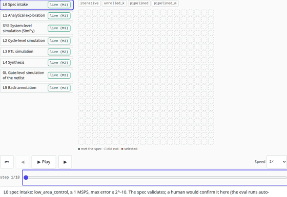
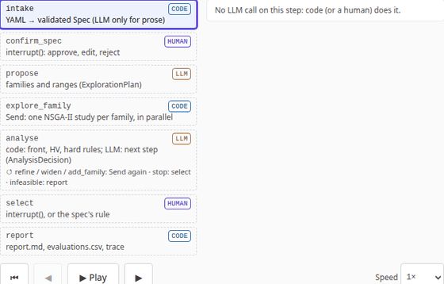
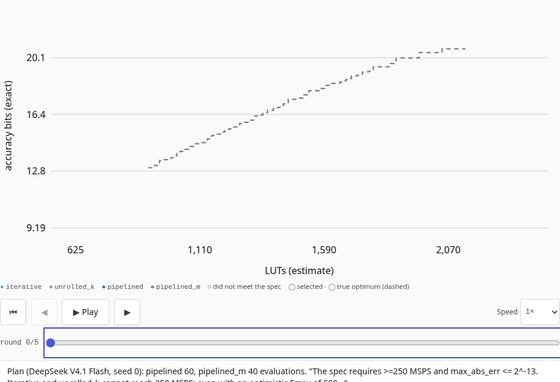
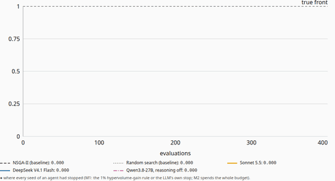
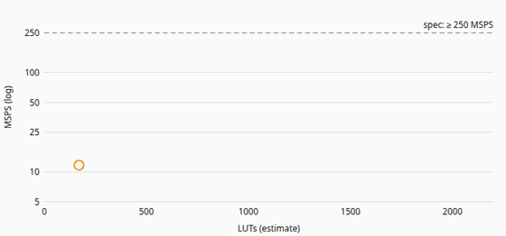
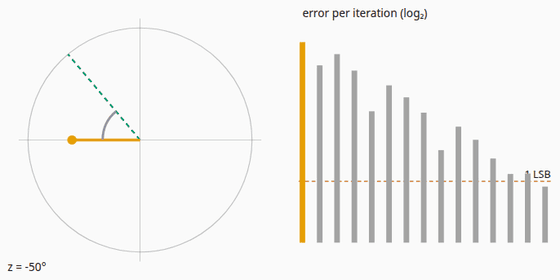
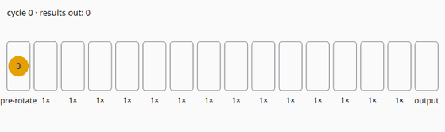

# HW Design-Space Agent

**An agent optimised for hardware development: trade-off exploration.**

The showcase site for [HW_Design_Space_Agent](https://github.com/BrendanJamesLynskey/HW_Design_Space_Agent), a
LangGraph agent that explores hardware trade-offs from one spec. Every page is built around an animation, and every
number on it comes from the agent's recorded runs (vendored at a pinned commit, with hashes) or from TypeScript ports
of its tested models, which reproduce the Python reference exactly.

**Live:** https://hw-design-space-agent.vercel.app



> _An AI agent is the perfect environment for trade-off exploration._ · _Avoid premature optimisation._

## Pages

| Page            | The animation                                                                                                                                                                                                                                                                                                                                                                                        | Driven by                                                                                                                   |
| --------------- | ---------------------------------------------------------------------------------------------------------------------------------------------------------------------------------------------------------------------------------------------------------------------------------------------------------------------------------------------------------------------------------------------------- | --------------------------------------------------------------------------------------------------------------------------- |
| `/` Home        | **One spec, every level**: a spec card enters the fidelity ladder; at L1 the 400 evaluations of a real recorded run fill in round by round, the LLM's decisions and token/$ counters tick from its trace, the chosen design is marked. Planned levels stay ghosted with their milestone badge                                                                                                        | the recorded run (Sonnet 5.5, `high_precision`, seed 0)                                                                     |
| `/why`          | **Micro-optimise the default, or explore first**: a hill-climb from the reference iterative CORDIC against the iterative family's ceiling and the true Pareto front, on the real grid. With the Knuth quote, verified against the paper                                                                                                                                                              | `hw_dse.evaluate` on all 39,690 iterative designs; the exhaustive ground truth                                              |
| `/case-study`   | **CORDIC micro-rotations, bit for bit** (sliders for W, N and the angle; exact error over all 2^W angles in a Web Worker); **the families as datapaths** (angles flowing cycle by cycle, with throughput, latency, LUTs, FFs and Fmax); **the true Pareto front** with a readout                                                                                                                     | TS ports of the bit-exact golden model and the Artix-7 cost model                                                           |
| `/how-it-works` | **The graph, replayed from a recorded trace**: the LangGraph nodes light up in the order a real run went through them, the LLM's structured decisions quoted as returned, failed calls shown, code's hard rules shown, token and $ counters ticking; any of the 48 runs. Also the ladder with badges, the provenance labels, verification at every level and the measured fleet timeline             | the run's `llm_trace.jsonl`, `report.md` and `evaluations.csv`, checked against each other and its summary                  |
| `/results`      | **Pareto replay** of any recorded run, round by round, against the true front, with the LLM's rationale per round; **the hypervolume race** (agents vs NSGA-II vs random vs the true front); per-spec tables with the selected designs, tokens, $ per run and $ per evaluated design; a **cost and labour calculator** whose people-side figures the reader enters. Where the agent lost comes first | the runs' evaluations; the baselines re-run with the repo's own code (each reproduces `baselines.json` exactly); results.md |
| `/roadmap`      | M1–M4 with status from the README roadmap, what each adds to the ladder, the PRs                                                                                                                                                                                                                                                                                                                     | the vendored README                                                                                                         |
| `/about`        | software and hardware, two columns, each line linked to the owner's personal projects on GitHub                                                                                                                                                                                                                                                                                                      | —                                                                                                                           |

### The animations

Recorded frame by frame from the model states (`pnpm animations`, against a local build; reduced motion, every frame
set by the scrub bar), so each GIF is reproducible.

|                                                                           |                                                                                        |
| ------------------------------------------------------------------------- | -------------------------------------------------------------------------------------- |
|   |                        |
|                            |  |
|  |                          |

## What the site claims, and why it is true

- **Ladder badges** come from the roadmap table in the agent repo's README at the vendored commit: only M1 is done,
  so only L0 (spec intake) and L1 (analytical exploration) are live. A planned level is never animated as if it ran.
- **The honest headline** (milestone 1): the agent is the better _selector_ (lower selection regret than NSGA-II and
  random search on every feasible spec), NSGA-II the better _front-mapper_ (higher hypervolume on two of three specs).
  Every model, on every seed, declared the infeasible spec infeasible.
- **Costs** are provider-reported (OpenRouter) usage and dollars per run, per spec and per evaluated design, with
  model IDs and the run date; their sum ($1.7367) is checked against the traces. Projections are labelled.
- **The hypervolume race** re-runs NSGA-II and random search with the repo's own code at the vendored commit
  (Optuna pinned in `reference/requirements.txt`); the export refuses a curve unless the re-run reproduces the
  recorded final hypervolume, evaluations to 95% and selected design exactly.
- **The calculator** projects only from measured means; the reader enters any rate or hours, and nothing is
  pre-filled.
- **Provenance labels** follow the repo: _exact_ (bit-accurate golden model), _estimate_ (cost model calibrated to two
  Vivado results), _measured_.

## Data and models

```
vendor/hw_dse/            HW_Design_Space_Agent files at the pinned commit (VENDORED.json: commit + sha256 per file)
scripts/vendor-dse.ts     pnpm vendor:dse <commit>: copies them from `git show`, never the working tree
scripts/export_dse.py     vendored files + the Python reference -> src/data/*.json and tests/fixtures/*.json;
                          every exported results row must appear verbatim in the repo's results.md
src/lib/dse/cordic.ts     TS port of the bit-exact CORDIC golden model
src/lib/dse/cost.ts       TS port of the Artix-7 cost model and the derived metrics
src/lib/dse/families.ts   the design point and its schedule
src/lib/dse/{hero,climb,datapath,captions}.ts   animation states and captions, pure functions
src/lib/dse/{trace,replay,race,calc,fleet}.ts    the replays, the race, the calculator and the fleet (part B)
src/data/runs/*.json      one file per recorded run (calls, rounds, evaluations), loaded on demand
src/data/race.json        HV-fraction curves per spec, method and seed
```

The parity tests compare the TS ports with fixtures written by the Python reference **with no tolerance**: the atan
table, every register of every micro-rotation, the outputs on a sweep plus the edge codes, a SHA-256 over all 2^W
outputs for every W ≤ 16, and every field of the cost model for 100 designs across the four families. Only the
accuracy metrics (which take cos and sin) use a tolerance, far below one LSB.

## Checks

| Check                                                                                                                                                                                      | Command                                |
| ------------------------------------------------------------------------------------------------------------------------------------------------------------------------------------------ | -------------------------------------- |
| Unit tests (parity, frames, captions, values, vendored hashes), coverage thresholds                                                                                                        | `pnpm test:coverage`                   |
| Site data and fixtures up to date with the reference at the vendored commit                                                                                                                | `python scripts/export_dse.py --check` |
| Vendored data, trace cost sum, honesty checks                                                                                                                                              | `python -m pytest -q tests/python`     |
| e2e: every page at 1280 and 390 px in light and dark; every animation plays, steps, scrubs, resets and answers the keyboard; reduced motion; frame tests; ladder badges; wording; no email | `pnpm test:e2e`                        |
| axe (serious/critical) in light and dark                                                                                                                                                   | part of `pnpm test:e2e`                |
| Lighthouse ≥ 0.9 (performance, accessibility, best practices)                                                                                                                              | `pnpm lighthouse`                      |

```bash
pnpm install
python3 -m venv .venv && .venv/bin/pip install -r reference/requirements.txt
.venv/bin/python scripts/export_dse.py --check
pnpm dev
```

## Origin

The stack, styling and animation framework (Next 14, MDX, Tailwind, the stepper and clock, reduced-motion handling,
the CI and test layout) are copied from
[Agent Harnesses Explained](https://github.com/BrendanJamesLynskey/agent-harnesses-explained). This is a showcase,
not one of the `*-explained` family, so it does not carry the family's site switch; its footer links the related
agent sites and the [LLMs hub](https://github.com/BrendanJamesLynskey/LLMs) instead.

## Licence

MIT.
