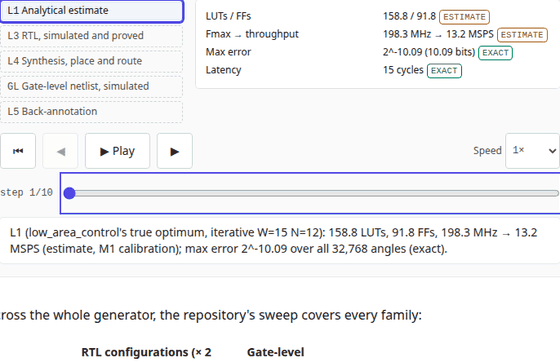
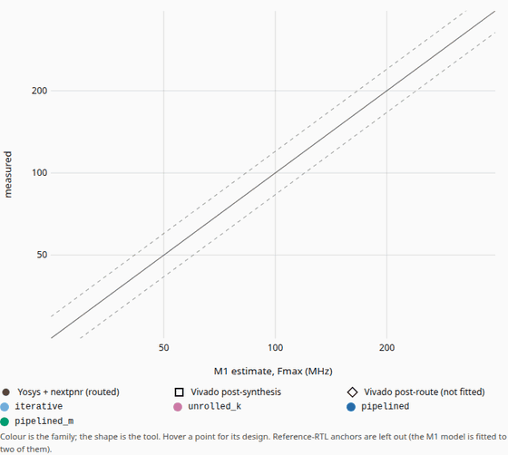
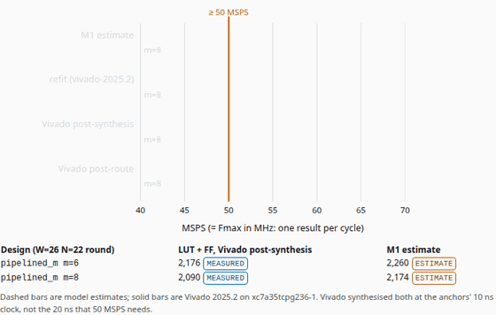
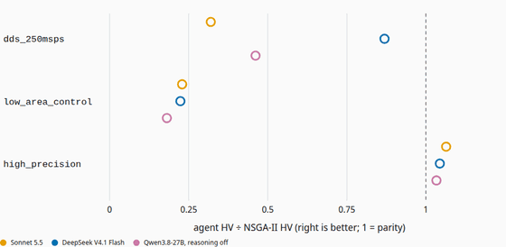

# HW Design-Space Agent

**An agent optimised for hardware development: trade-off exploration.**

The showcase site for [HW_Design_Space_Agent](https://github.com/BrendanJamesLynskey/HW_Design_Space_Agent), a
LangGraph agent that explores hardware trade-offs from one spec. Every page is built around an animation, and every
number on it comes from the agent's recorded runs (vendored at a pinned commit, with hashes) or from TypeScript ports
of its tested models, which reproduce the Python reference exactly.

**Live:** https://hw-design-space-agent.vercel.app


> _An AI agent is the perfect environment for trade-off exploration._ · _Avoid premature optimisation._

## Pages

| Page            | The animation                                                                                                                                                                                                                                                                                                                                                                                                                                                                                                                                                      | Driven by                                                                                                                                           |
| --------------- | ------------------------------------------------------------------------------------------------------------------------------------------------------------------------------------------------------------------------------------------------------------------------------------------------------------------------------------------------------------------------------------------------------------------------------------------------------------------------------------------------------------------------------------------------------------------ | --------------------------------------------------------------------------------------------------------------------------------------------------- |
| `/` Home        | **One spec, every level**: a spec card enters the fidelity ladder; at L1 the 400 evaluations of a real recorded M2 run fill in round by round, the LLM's decisions and token/$ counters tick from its trace, the chosen design (the true optimum) is marked, then goes down the live levels: RTL in two simulators, synthesis, the gate-level netlist and the run's own back-annotation. Planned levels stay ghosted with their milestone badge                                                                                                                    | the recorded run (Sonnet 5.5, `low_area_control`, M2 seed 2) and the repo's worked example of the design it selected                                |
| `/why`          | **Micro-optimise the default, or explore first**: a hill-climb from the reference iterative CORDIC against the iterative family's ceiling and the true Pareto front, on the real grid. With the Knuth quote, verified against the paper                                                                                                                                                                                                                                                                                                                            | `hw_dse.evaluate` on all 39,690 iterative designs; the exhaustive ground truth                                                                      |
| `/case-study`   | **CORDIC micro-rotations, bit for bit** (sliders for W, N and the angle; exact error over all 2^W angles in a Web Worker); **the families as datapaths** (angles flowing cycle by cycle, with throughput, latency, LUTs, FFs and Fmax); **the true Pareto front** with a readout; **measured against estimated** (every synthesised design, tool by tool, then the refit); **high_precision: m=6 or m=8?** (the winner against its neighbour, from the M1 estimate to Vivado's routed timing)                                                                      | TS ports of the bit-exact golden model and the Artix-7 cost model; the L4/Vivado tables and the L5 refit report                                     |
| `/how-it-works` | **The graph, replayed from a recorded trace**: the LangGraph nodes light up in the order a real run went through them (M2's `back_annotate` included), the LLM's structured decisions quoted as returned, code's front-mapping rounds and hard rules shown, token and $ counters ticking; any of the 108 runs (M1 and M2). **One design down the ladder**: L1 estimate, generated RTL, two simulators, formal, synthesis, gate level, measured against estimated, the refit. Also the ladder with badges, verification per family and the measured fleet timelines | the run's `llm_trace.jsonl`, `report.md` and `evaluations.csv`, checked against each other and its summary; the repo's worked example and L3 tables |
| `/results`      | **M1 → M2 against NSGA-II** (hypervolume and regret, spec by spec); where it got worse, first; **Pareto replay** of any recorded run; **the hypervolume race** (M2 or M1); per-spec tables (mean ± std over 5 seeds) with the selected designs, tokens, $ per run and $ per evaluated design; the spend three ways; a **cost and labour calculator** whose people-side figures the reader enters; M1's results kept                                                                                                                                                | the runs' evaluations; the baselines re-run with the repo's own code (each reproduces `baselines.json` / `baselines_m2.json` exactly); results.md   |
| `/roadmap`      | M1–M4 with status from the README roadmap (with its follow-up rows), what each adds to the ladder, the PRs                                                                                                                                                                                                                                                                                                                                                                                                                                                         | the vendored README                                                                                                                                 |
| `/record`       | **Project record: how it was built and why**: summary, principles, the planner/executor process and its verification gates, the decision log as a timeline, results, what review found, limitations, what's next                                                                                                                                                                                                                                                                                                                                                   | `content/record/project_record.md` (the planner's record, checked number by number against the vendored data in `tests/unit/record.test.ts`)        |
| `/about`        | software and hardware, two columns, each line linked to the owner's personal projects on GitHub                                                                                                                                                                                                                                                                                                                                                                                                                                                                    | —                                                                                                                                                   |

### The animations

Recorded frame by frame from the model states (`pnpm animations`, against a local build; reduced motion, every frame
set by the scrub bar), so each GIF is reproducible.

|                                                                           |                                                                                        |
| ------------------------------------------------------------------------- | -------------------------------------------------------------------------------------- |
|   |                        |
|                            |  |
|  |                          |
|       |                      |
|              |                                    |

## What the site claims, and why it is true

- **Ladder badges** come from the roadmap table in the agent repo's README at the vendored commit: M1 and M2 are done,
  so L0, L1, L3 (RTL), L4 (synthesis), the gate level and L5 (back-annotation) are live; cycle-level and SimPy
  system-level simulation are planned (M3). A planned level is never animated as if it ran.
- **The honest headline**: M1's agent was the better _selector_ and NSGA-II the better _front-mapper_; M2 closed the
  front-mapping gap (0.96–1.09× NSGA-II's hypervolume) and kept the better selection in 8 of 9 model-and-spec cells.
  Where it got worse (Qwen on `high_precision`, DeepSeek's regret, the full budget every time) is stated first.
  Every model, on every seed of both milestones, declared the infeasible spec infeasible.
- **Costs** are provider-reported (OpenRouter) usage and dollars per run, per spec and per evaluated design, with
  model IDs and run dates; the export checks them against the traces (M1 $1.7367; M2 $1.6488 + pilot $0.0166 =
  traces $1.6654) and the key's usage before and after M2 ($1.657747). Projections are labelled.
- **Measurements** (L3 verification, formal, L4 synthesis, Vivado, the L5 refits) are the repo's tables; the export
  recomputes every M1 estimate and refit prediction with the Python reference and checks the summaries against the
  repo's own text.
- **The hypervolume race** re-runs NSGA-II and random search with the repo's own code at the vendored commit
  (Optuna pinned in `reference/requirements.txt`); the export refuses a curve unless the re-run reproduces the
  recorded final hypervolume, evaluations to 95% and selected design exactly.
- **The calculator** projects only from measured means; the reader enters any rate or hours, and nothing is
  pre-filled.
- **Provenance labels** follow the repo: _exact_ (bit-accurate golden model), _estimate_ (cost model calibrated to two
  Vivado results, or a named refit), _measured_ (tool and version named).

## Data and models

```
vendor/hw_dse/            HW_Design_Space_Agent files at the pinned commit (VENDORED.json: commit + sha256 per file)
scripts/vendor-dse.ts     pnpm vendor:dse <commit>: copies them from `git show`, never the working tree
scripts/export_dse.py     vendored files + the Python reference -> src/data/*.json and tests/fixtures/*.json;
                          every exported results row (M1 and M2) must appear verbatim in the repo's results.md
scripts/export_ladder.py  M2's ladder data -> src/data/ladder.json (L3, formal, L4, Vivado, L5, worked example)
src/lib/dse/cordic.ts     TS port of the bit-exact CORDIC golden model
src/lib/dse/cost.ts       TS port of the Artix-7 cost model and the derived metrics
src/lib/dse/families.ts   the design point and its schedule
src/lib/dse/{hero,climb,datapath,captions}.ts   animation states and captions, pure functions
src/lib/dse/{trace,replay,race,calc,fleet}.ts    the replays, the race, the calculator and the fleet (part B)
src/lib/dse/{ladder,m2frames}.ts                 M2's ladder data and its animations' states (part C1)
src/lib/record.ts         the project record's parser (/record)
src/data/runs/*.json      one file per recorded run (M1: <spec>__<stamp>, M2: m2__<spec>__<stamp>), loaded on demand
src/data/race.json        HV-fraction curves per milestone, spec, method and seed
src/data/ladder.json      M2's ladder data
```

The parity tests compare the TS ports with fixtures written by the Python reference **with no tolerance**: the atan
table, every register of every micro-rotation, the outputs on a sweep plus the edge codes, a SHA-256 over all 2^W
outputs for every W ≤ 16, and every field of the cost model for 100 designs across the four families. Only the
accuracy metrics (which take cos and sin) use a tolerance, far below one LSB.

## Checks

| Check                                                                                                                                                                                      | Command                                |
| ------------------------------------------------------------------------------------------------------------------------------------------------------------------------------------------ | -------------------------------------- |
| Unit tests (parity, frames, captions, values, vendored hashes), coverage thresholds                                                                                                        | `pnpm test:coverage`                   |
| Site data and fixtures up to date with the reference at the vendored commit                                                                                                                | `python scripts/export_dse.py --check` |
| Vendored data, trace cost sums, honesty checks, ladder data                                                                                                                                | `python -m pytest -q tests/python`     |
| e2e: every page at 1280 and 390 px in light and dark; every animation plays, steps, scrubs, resets and answers the keyboard; reduced motion; frame tests; ladder badges; wording; no email | `pnpm test:e2e`                        |
| axe (serious/critical) in light and dark                                                                                                                                                   | part of `pnpm test:e2e`                |
| Lighthouse ≥ 0.9 (performance, accessibility, best practices)                                                                                                                              | `pnpm lighthouse`                      |

```bash
pnpm install
python3 -m venv .venv && .venv/bin/pip install -r reference/requirements.txt
.venv/bin/python scripts/export_dse.py --check
pnpm dev
```

## Origin

The stack, styling and animation framework (Next 14, MDX, Tailwind, the stepper and clock, reduced-motion handling,
the CI and test layout) are copied from
[Agent Harnesses Explained](https://github.com/BrendanJamesLynskey/agent-harnesses-explained). This is a showcase,
not one of the `*-explained` family, so it does not carry the family's site switch; its footer links the related
agent sites and the [LLMs hub](https://github.com/BrendanJamesLynskey/LLMs) instead.

## Licence

MIT.
