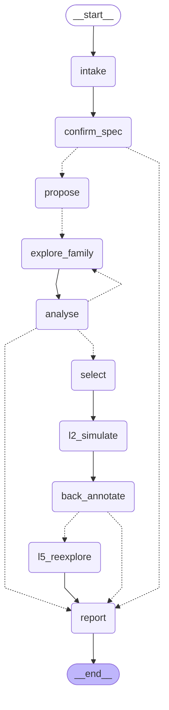

# HW Design Space Agent

[](https://github.com/BrendanJamesLynskey/HW_Design_Space_Agent/actions/workflows/ci.yml)

A **LangGraph agent for hardware design-space exploration (DSE)**. You give it a
hardware spec (function, throughput, accuracy, area/power budget); it converges on a
Pareto-optimal architecture by walking down a ladder of fidelity, from fast analytical
models to verified RTL and real synthesis.

The running example is a **CORDIC sin/cos unit on an Artix-7 FPGA**. Milestone 1 built
spec intake, analytical exploration and an eval that asks the obvious question: *why use
an LLM at all?* Milestone 2 climbed the rest of the ladder: a generator that turns any
explored design into verified SystemVerilog (simulated in two simulators against the
golden model, formally checked, simulated again at gate level after synthesis),
open-source synthesis and place-and-route on the anchors' Artix-7 part, a back-annotation
path that refits the cost model to measured data, and an agent that maps the whole
trade-off curve. **Milestone 3 (this release)** puts the design *in a system*: an **L2**
rung with a cycle-accurate model of every family (checked cycle for cycle against the
RTL) and SimPy models of a DDS, a control loop and a bursty request stream; specs with
system-level constraints ("p99 latency ≤ 0.4 µs with bursts of 8") where the winner
differs from the throughput-only view; an L5 loop that re-explores when a measurement
changes the winner; and an optional outer **campaign agent** on LangChain Deep Agents,
A/B-tested against the structured graph.

**Showcase site:** [hw-design-space-agent.vercel.app](https://hw-design-space-agent.vercel.app/)
([source](https://github.com/BrendanJamesLynskey/hw-design-space-agent)) presents this
project with animations driven by this repository's recorded runs and models: the graph
replayed from the eval traces, Pareto replays, the hypervolume race against the baselines,
and the LLM cost per run.

## The design principle

**The LLM is never the optimiser and never produces a PPA, accuracy or system-level number.**

The LLM does the architect's job: it reads the spec, chooses architecture families and
parameter ranges from a fixed registry, reads compact summaries of results, and decides
whether to refine, widen, add a family, declare the spec infeasible, or stop.
Deterministic code produces every number:

| number | produced by | provenance label |
|---|---|---|
| max-abs / RMS error, accuracy bits | bit-accurate NumPy golden model, exhaustive angle sweep (W ≤ 16) or documented dense sweep | *exact* |
| latency in cycles | the family's schedule | *exact* |
| LUTs, FFs, Fmax, throughput, latency (ns), power index | analytical cost model calibrated to Vivado results | *estimate* (with calibration id) |
| RTL correctness: output codes and latency of generated SystemVerilog, before and after synthesis | Verilator and Icarus simulations compared with the golden model, angle by angle; SymbiYosys proofs | *exact* |
| LUTs, FFs, CARRY4s, Fmax | Yosys + nextpnr-xilinx (post-route) and Vivado 2025.2 (post-synthesis and post-route) on xc7a35tcpg236-1 | *measured (tool, version)* |
| refitted cost-model constants, per-tool correction factors | least squares over measured points | *estimate* naming the refit calibration |
| system metrics: sustained throughput under back-pressure, p50/p99 latency, batch latency, queue depth, utilisation (M3) | SimPy models of the spec's system, clocked at the design's estimated Fmax, driven by the cycle model's contract | *simulated (model, version)*, naming the clock it ran at |
| the same system metrics during exploration (M3) | analytic bounds, optimistic by construction (L1 screening) | *estimate* (L1 analytic bound) |
| DDS SNR / SFDR (M3) | the golden model's exact outputs for a coherent DDS tone, FFT | *simulated (golden-model DDS, ...)* |
| the search itself | Optuna NSGA-II inside the LLM's ranges, plus code-driven front-mapping rounds; Pareto and hypervolume maths | — |

This shows up in the types: the LLM's structured-output schemas
(`src/hw_dse/agent/schemas.py`) have fields for families, ranges, budget shares,
decisions and rationale, and no field where a number about a design could go. Every
range the LLM proposes is clamped against the registry in code, and the hard stopping
rules (round cap, budget, hypervolume-gain threshold, "infeasible" is refused while
feasible designs exist) are applied by code after each LLM decision and logged in the
report.

## Roadmap

| milestone | fidelity levels | status |
|---|---|---|
| **M1** | **L0** spec intake (NL/YAML → validated `Spec`, human confirmation) · **L1** analytical exploration (LLM-chosen families and ranges, Optuna multi-objective search over fast cost models, Pareto front) · baseline eval | **done** |
| **M2** | **L3** SystemVerilog generator for every family, verified against the golden model (Verilator + Icarus, exhaustive for W ≤ 16), SymbiYosys proofs (W = 8) · **L4** open-source synthesis + place-and-route (Yosys + nextpnr-xilinx), gate-level simulation of the netlist · **L5** measured-points schema, per-tool refit of the cost model, back-annotation node that flags a winner change · whole-curve agent levers · 5-seed eval | **done** |
| M2 follow-ups | **Vivado 2025.2 on 14 generated designs, refit `vivado-2025.2`** | **done** |
| | measured power · `high_precision` m=8 synthesised at a 20 ns constraint · per-family-class path factor (deferred, not rejected) | planned |
| **M3** | **L2** cycle-accurate interface model per family (validated against the RTL cycle for cycle) + SimPy system models (DDS + mixer, control loop, bursty stream) · system-level constraints in specs, L1 bounds, L2 shortlist and re-selection · **L5 loop**: re-explore under the refit when a measured winner changes · `map_front` blind-spot fix (gated lever) · M2 replay proof · **campaign agent** on Deep Agents with cross-run memory · A/B and memory on/off eval | **done** (see the A/B for what the campaign agent did and did not achieve) |
| | live L4 inside campaigns · any campaign-agent rework (only if the M4 fleet design needs it) | planned |
| M4 | more functions and targets (an ASIC gate-equivalent `CostModel`), a fleet of agents, richer family registry, the write-up | planned |

## The fidelity ladder

| level | what | where | status |
|---|---|---|---|
| L0 | spec intake: YAML or natural language → validated `Spec`, human confirmation | `spec.py`, `intake` node | done (M1) |
| L1 | analytical exploration: golden-model accuracy (*exact*) + cost model (*estimate*), NSGA-II inside LLM-chosen boxes | `models/`, `explore.py`, agent | done (M1); front-mapping levers (M2) |
| L2 | cycle-accurate interface model per family; SimPy system models; L1 analytic bounds; shortlist + re-selection | `l2/`, `l2_simulate` node | **done (M3)**: 48/48 bursty traces identical to the RTL (Verilator + Icarus); 2 system specs change the winner |
| L3 | parametrised SystemVerilog per family; Verilator + Icarus vs golden model; SymbiYosys | `rtl/`, `rtl_golden/`, `formal/` | **done (M2)**: 47 configurations × 2 simulators, 0 mismatches; 7 proofs |
| L4 | synthesis + place-and-route; gate-level simulation of the netlist | `synth/flow.py`, `synth/gatesim.py` | **done (M2)** with Yosys 0.68 + nextpnr-xilinx: 39 measured points; 22 gate-level runs, 0 mismatches. Vivado 2025.2: 14 generated designs |
| L5 | back-annotation: measured vs estimate, refit per tool, flag winner changes, re-explore | `synth/recalibrate.py`, `back_annotate` + `l5_reexplore` nodes | **done** (M2: comparison, refit, flagging; M3: re-exploration under the refit) |

## Agent graph

Generated from the compiled graph (`hw-dse diagram`); `tests/test_diagram.py` fails if
this drifts from the code.

<!-- graph:start -->

<!-- graph:end -->

| node | who decides | what happens |
|---|---|---|
| `intake` | code (YAML) / LLM (natural language) | YAML that validates as a `Spec` is loaded directly; otherwise the LLM fills a `SpecDraft` and code converts it |
| `confirm_spec` | human | `interrupt()`: approve, edit or reject (`--auto-approve` for CI and batch runs) |
| `propose` | LLM → code | `ExplorationPlan`: families, ranges, budget shares, rationale; code clamps and budgets it |
| `explore_family` | code | one Optuna NSGA-II study per family, fanned out with `Send`; results appended by a reducer |
| `analyse` | code → LLM → code | code merges the front, feasibility, hypervolume; LLM reads a compact summary and returns `refine` / `widen` / `add_family` / `map_front` / `infeasible` / `stop`; code applies the stopping rules and the whole-curve levers (below) |
| `select` | human / code | `interrupt()` to pick a design off the front, or auto-select by the spec's rule |
| `l2_simulate` (M3) | code | L2: every L1-feasible design the run evaluated is simulated in the spec's system (SimPy; cached per (latency, ii, Fmax), so a few dozen simulations), system constraints re-checked on simulated numbers, the best passing design becomes the selection; the report shows the top 5. Not just the L1 front: a design that passes L2 can be dominated in the L1 objectives by one that only passed the bound (the `multiaxis_control` case; fixed after review). No system scenario: the selected design's contract and DDS spectrum go in the report, nothing changes |
| `back_annotate` | code | L5: measured data for the selected design (committed L4 CSV, or a fresh synthesis if configured) vs its estimates; front designs with measurements re-scored on the Vivado scale; flags a winner change in the report |
| `l5_reexplore` (M3) | code | only after a flagged winner change: 60 evaluations (a separate L5 budget) of NSGA-II around the measured front designs under the `vivado-2025.2` refit; re-selection under the refit (`l5_selected`). The L1 evaluations and selection are untouched |
| `report` | code | `runs/<spec>/<timestamp>/`: `report.md`, `pareto.png`, `evaluations.csv`, `llm_trace.jsonl` |

State is checkpointed with LangGraph's `SqliteSaver`, so a run paused for human input,
or killed, resumes from its last completed step (`hw-dse resume`).

### Whole-curve levers (M2)

M1's agent was a better *selector* than NSGA-II but a worse *front-mapper*: it dived at
the corner the spec's selection rule picks, and the 1% HV-gain rule then ended the run
with a narrow front. M2 adds deterministic levers in `src/hw_dse/agent/graph.py`
(`LEVERS_M2`); the LLM can only *choose* one of them:

* **coverage reserve (40%)**: once a feasible design exists, the LLM's own rounds may
  spend at most 60% of the budget. Whenever the run would stop (the LLM says `stop`, the
  HV-gain rule fires, the round cap or the LLM's share is reached) with feasible designs
  and budget left, code spends what is left on one **front-mapping round** and stops
  without another LLM call. That final round is **exempt from the spec's `max_rounds` and
  `evals_per_round`** (a run has at most `max_rounds` + 1 rounds, and the round can exceed
  100 evaluations; in the M2 eval 16 of 62 runs had 5 rounds and 22 had a 160–200
  evaluation round); `total_evals` is never exceeded, so the comparison with the baselines
  stays like for like. While nothing is feasible the LLM keeps the whole budget, so
  infeasibility is still established properly.
* **front-mapping round**: NSGA-II per family on the merged front, over the registry's
  full ranges with `data_width`/`n_iter` starting just below the front (the
  "front-anchored" box).
* **`map_front`**: a new decision the LLM can take in `analyse` to run such a round
  itself; its summary now says how much of each objective the front covers.

They were tuned **offline, without spending anything**: `ReplayArchitect` replays the
decisions the M1 LLMs actually made (from the committed traces) into today's graph.
With the levers off it reproduces every recorded M1 score exactly; with them on, over the
12 recorded runs per spec, mean HV rose from 0.43 to 0.90 (`dds_250msps`) and 0.20 to
0.90 (`low_area_control`) with selection regret no worse (`eval/tune_levers.py`,
`eval/data/levers_offline*.json`, three rounds: reserve size, box, warm starts, slack). A
replay holds the LLM's decisions fixed, so the live 5-seed eval below is the real test.

## The M1 design space: CORDIC sin/cos

The reference implementation is
[BrendanJamesLynskey/CORDIC](https://github.com/BrendanJamesLynskey/CORDIC)
(`cordic_rotation_iterative.sv`, `cordic_rotation_pipelined.sv`; 16-bit data,
14 iterations, quadrant pre-rotation, gain pre-compensation).

**Families** (`src/hw_dse/families.py`): the LLM can only choose from these.

| family | schedule | results / cycle | latency |
|---|---|---|---|
| `iterative` | 1 micro-rotation per cycle, barrel shifters, FSM (reference) | 1/(N+3) | N+3 |
| `unrolled_k` | k chained micro-rotations per cycle | 1/(⌈N/k⌉+3) | ⌈N/k⌉+3 |
| `pipelined` | one registered stage per micro-rotation (reference) | 1 | N+2 |
| `pipelined_m` | a register every m stages | 1 | ⌈N/m⌉+2 |

**Parameters**: data width W (8–28), iterations N (4–30), angle-path width
A = W + angle_guard (angle_guard −2…+4), fractional guard bits on x/y (0–4),
truncation vs round-half-up, plus k or m (2–8). That is 39,690 numeric
configurations and 635,040 designs in total, small enough to enumerate for the eval.

### Golden model: bit-exact against the RTL

`src/hw_dse/models/cordic_bitexact.py` is a vectorised NumPy model of the datapath.
For the reference configuration it is **bit-exact on all 65,536 input angles** against
Icarus Verilog simulations of both reference modules (`rtl_harness/tb_bitexact.sv`,
`tests/test_bitexact_rtl.py`; the RTL is vendored at a pinned commit and CI installs Icarus).
Accuracy is measured over every angle for W ≤ 16, and over up to 131,072 angles (2¹⁶ strided
plus 2¹⁶ seeded-random) above that. In the dense case the max error is exact for those
angles, so it is a lower bound on the true worst case.

The reference design's exact error is 10.5 LSB max / 2.26 LSB RMS (≈ 2⁻¹⁰·⁶), dominated
by truncation in the x/y shifts. Fractional guard bits fix that. A wider angle path then
fixes the atan-LUT quantisation that takes over. Neither helps much alone.

### Cost model: calibrated, but weakly

`src/hw_dse/models/cost_fpga.py` counts structure (adder bits, barrel-shifter mux trees,
ROM bits, registers, LUT/mux levels and CARRY4 chains on the critical path) and converts
it to Artix-7 LUTs, FFs and Fmax. The primitive delays are read off the Vivado timing
reports. Five free constants are solved from the two anchors in the CORDIC repo
(Vivado 2025.2, xc7a35tcpg236-1). They live with their sources in
`src/hw_dse/models/calibration_artix7.yaml`.

| anchor | LUTs (model / Vivado) | FFs (model / Vivado) | Fmax MHz (model / Vivado) |
|---|---|---|---|
| iterative, W=16, N=14 | 170.0 / 170 | 95.8 / 95 | 198.3 / 198.3 |
| pipelined, W=16, N=14 | 745.0 / 745 | 776.9 / 784 | 272.9 / 272.9 |

**Two anchor points is a weak calibration.** It pins the model at the defaults and makes
it plausible elsewhere, but everything away from W=16/N=14, and both families with no
anchor at all (`unrolled_k`, `pipelined_m`), is an extrapolation. M2 measures how far off
it is (L4) and refits it (L5), below; the eval still uses this calibration so M1 and M2
are scored on the same ground truth. Throughput = Fmax × results per cycle.
The **power index** is (LUTs + FFs) × operating clock × activity, normalised to the
reference iterative design at 100 MHz. It is a relative ranking aid, never watts.

## L3: RTL generator and verification (M2)

`src/hw_dse/rtl/generator.py` turns any `ArchConfig` into one synthesisable
SystemVerilog module. All four families come from one generator (`iterative` is
`unrolled_k` with k=1, `pipelined` is `pipelined_m` with m=1), honouring every knob of
the golden model (W, N, angle width, fractional guard bits, trunc/round):

* the atan LUT and the gain constant are produced by **the golden model's own functions**
  (`atan_lut`, `init_x`), never a second copy;
* each add/subtract is one adder with an XOR-ed operand, and round-half-up shifts reuse its
  **carry-in** (`(v + 2^(i-1)) >>> i == (v >>> i) + v[i-1]`), so rounding costs one XOR;
* uniform ports: `clk, rst, valid_in, ready, theta_in, valid_out, cos_out, sin_out`.

| family | latency (cycles, `valid_in` sampled → `valid_out`) | results |
|---|---|---|
| `iterative` | N + 3 | one every N + 3 cycles (`ready` low while busy) |
| `unrolled_k` | ⌈N/k⌉ + 3 | one every ⌈N/k⌉ + 3 cycles |
| `pipelined` | N + 2 | one per cycle (`ready` tied high) |
| `pipelined_m` | ⌈N/m⌉ + 2 | one per cycle |

Generated RTL goes to `build/`; one **golden example per family** is committed in
`rtl_golden/` and a test regenerates and diffs it. All committed examples, and 300 random
registry designs, are `verilator --lint-only -Wall` clean.

**Verification** (`src/hw_dse/rtl/sim.py`, `rtl_harness/tb_generated.sv`; table:
`eval/data/l3_verification.csv`): one harness drives every family in **Verilator 5.020**
and **Icarus 12**, and every output code is compared with `cordic_sincos()`. All 2^W
angles for W ≤ 16, the documented dense set above (up to 131,072 codes: 2¹⁶ strided + 2¹⁶ seeded-random, deduplicated; e.g. 130,707 at W=24, 109,112 at W=18). The measured latency of
every result is checked against the documented one.

| check | configurations | result |
|---|---|---|
| generated RTL, Verilator + Icarus | 47 (every family at W ∈ {8, 12, 16, 24}, N from 4 to 30, k, m ∈ {2, 3, 4, 8}, both rounding modes, angle guard −2…+2, guard bits 0…4, the three ground-truth winners) × 2 simulators | **0 mismatches** in 94 runs, latency as documented everywhere |
| generated vs vendored reference RTL (W=16, N=14, `iterative` and `pipelined`) | all 65,536 angles | **bit-identical outputs** |
| gate level: Yosys-mapped netlist + `cells_sim.v` (zero-delay) | every family exhaustively at W=8 (both rounding modes, both simulators) and at W=16 (Verilator; Icarus for the pipelined families) | **0 mismatches** in 22 runs |
| SymbiYosys, k-induction (`formal/`, `eval/data/formal_results.csv`) | `pipelined_m` ≡ `pipelined` after latency alignment (m = 2, 3, 4; trunc and round); valid/ready/latency properties for every family; all W = 8 | **7/7 proved**; two mutation tests (latency off by one, rounding mismatch) must and do fail, so the properties are not vacuous |

## L4: open-source synthesis on Artix-7 (M2)

`src/hw_dse/synth/flow.py` runs **Yosys 0.68** (`synth_xilinx -flatten -abc9`) and
**nextpnr-xilinx 0.8.2-81-g1743d0f4** (openXC7, prjxray-db timing) on **xc7a35tcpg236-1**,
the anchors' part, at the anchors' 10 ns constraint. LUT/FF/CARRY4 counts come from
Yosys, Fmax is nextpnr's **post-route** figure (median of three placement seeds). Every
row of `eval/data/l4_synthesis.csv` is labelled *measured (tool, version)* and carries its
exact command line; logs are in `eval/data/l4_logs/`, details in `eval/data/README.md`.

39 points: the two Vivado anchors as the **vendored reference RTL** and as **generated
RTL**, the six further points also measured in Vivado, the three ground-truth winners and a
spread over every family. Selected rows, measured vs the M1 cost model (*estimate*):

| design (W=16, N=14 unless noted) | RTL | LUTs meas / est | FFs meas / est | Fmax MHz meas / est |
|---|---|---|---|---|
| `iterative` (Vivado anchor: 170 / 95 / 198.3) | reference | 296 / 170 | 111 / 96 | 118.6 / 198.3 |
| `pipelined` (Vivado anchor: 745 / 784 / 272.9) | reference | 1115 / 745 | 769 / 777 | 171.8 / 272.9 |
| `iterative` | generated | 225 / 170 | 111 / 96 | 157.2 / 198.3 |
| `pipelined` | generated | 727 / 745 | 753 / 777 | 195.7 / 272.9 |
| `unrolled_k` k=2 / k=4 | generated | 269 / 253, 498 / 352 | 96 / 95, 96 / 94 | 90.7 / 105.4, 52.5 / 72.1 |
| `pipelined_m` m=2 / m=4 | generated | 719 / 745, 695 / 745 | 417 / 421, 252 / 254 | 120.5 / 171.0, 63.9 / 97.8 |
| `pipelined` W=12 / W=24 | generated | 537 / 581, 1094 / 1074 | 561 / 607, 1081 / 1116 | 191.3 / 281.9, 163.0 / 256.5 |

What the data says:

* **Same RTL, different tools.** On the identical reference RTL, Yosys maps 1.74× / 1.50×
  the LUTs Vivado reports, and nextpnr's post-route Fmax is 0.60× / 0.63× Vivado's
  post-*synthesis* estimate. These are different measurements (mapper, LUT accounting,
  routed vs unplaced timing), not errors in either. Compared like with like on generated
  RTL (post-route in both tools), nextpnr's Fmax is **0.75–0.84×** Vivado's on 8 of the 11
  designs both tools measured (`iterative`: 0.99×; the deep `pipelined_m` m=4: 0.64× and
  W=26 m=6: 0.59×).
* **In Yosys the generator's RTL synthesises smaller and faster** than the reference
  (−24% / −35% LUTs), probably because each micro-rotation is one add/sub with a carry-in
  rather than two adders and a mux (the reference also has reset and clock-enable on its
  data registers; untested which matters). It is mostly a Yosys effect: in **Vivado**
  generated and reference RTL **agree on area within ~4% but not on Fmax**, and the Fmax
  difference goes in opposite directions for the two families (see
  [the Vivado measurements](#vivado-20252-measurements)).
* **Across all 37 generated points** the M1 model's error vs Yosys/nextpnr is 16% RMS
  (LUTs), 7% (FFs) and 44% (Fmax: almost all of it the tools' different timing scale).
* **`unrolled_k`** in Yosys/nextpnr: at W=16 N=14, k=2 costs more LUTs than `iterative`
  and its two chained rotations roughly halve the clock, so throughput does not improve
  (90.7 MHz / 10 cycles ≈ 9.1 MSPS vs 157.2 MHz / 17 cycles ≈ 9.2 MSPS). Vivado
  differs on throughput; see below.

### Vivado 2025.2 measurements

Fourteen generated designs were run through Vivado 2025.2 on the maintainer's machine with
the anchors' flow (in-memory project, xc7a35tcpg236-1, 10 ns clock, `synth_design`, then
`opt_design; place_design; route_design`), in two batches:

* **Batch 1** (`eval/data/vivado_measured.csv`, reports in `eval/data/vivado_logs/`): the
  eight designs `scripts/vivado_points.py export` writes, i.e. the six points above plus
  the two *generated* anchors.
* **Batch 2** (`eval/data/vivado_measured_2.csv`, reports in `eval/data/vivado_logs_2/`):
  the two `high_precision` candidates (`pipelined_m` W=26 N=22 round, m=6 and m=8) and four
  more FSM points (`iterative` W=12 / W=24, `unrolled_k` k=3 / k=8).

`collect` re-creates each CSV from its reports byte for byte. Fmax = 1000 / (10 − WNS),
post-synthesis (as the anchors), with post-route alongside.

| design (generated RTL, W=16 N=14 unless noted) | LUT / FF | Fmax post-synth → post-route | M1 estimate (LUT / FF / Fmax error) | Yosys LUT / nextpnr Fmax |
|---|---|---|---|---|
| `iterative` (reference anchor: 170 / 95 / 198.3) | 175 / 96 | 172.8 → 158.1 | 170 / 96 / 198.3 (−3 / 0 / **+15%**) | 225 / 157.2 |
| `iterative` W=12 | 131 / 76 | 175.8 → 166.4 | 124 / 76 / 203.0 (−5 / 0 / +15%) | — |
| `iterative` W=24 | 251 / 136 | 166.2 → 155.2 | 262 / 136 / 189.5 (+4 / 0 / +14%) | — |
| `pipelined` (reference anchor: 745 / 784 / 272.9) | 720 / 751 | 327.4 → 232.2 | 745 / 777 / 272.9 (+3 / +3 / **−17%**) | 727 / 195.7 |
| `pipelined` W=12 | 533 / 557 | 341.2 → 230.6 | 581 / 607 / 281.9 (+9 / +9 / −17%) | 537 / 191.3 |
| `pipelined` W=24 | 1024 / 1076 | 303.2 → 204.8 | 1074 / 1116 / 256.5 (+5 / +4 / −15%) | 1094 / 163.0 |
| `pipelined_m` m=2 | 716 / 415 | 185.9 → 146.2 | 745 / 421 / 171.0 (+4 / +1 / −8%) | 719 / 120.5 |
| `pipelined_m` m=4 | 716 / 252 | 103.8 → 99.4 | 745 / 254 / 97.8 (+4 / +1 / −6%) | 695 / 63.9 |
| `pipelined_m` W=26 N=22 round m=6 (`high_precision` winner) | 1784 / 392 | **65.4** → 60.8 | 1864 / 395 / 62.5 (+4 / +1 / −4%) | 1827 / 35.7 |
| `pipelined_m` W=26 N=22 round m=8 | 1783 / 307 | **49.9** → 46.5 | 1864 / 310 / 48.0 (+5 / +1 / −4%) | — |
| `unrolled_k` k=2 | 246 / 95 | 113.8 → 114.7 | 253 / 95 / 105.4 (+3 / 0 / −7%) | 269 / 90.7 |
| `unrolled_k` k=3 | 532 / 97 | 69.8 → 73.7 | 320 / 95 / 71.7 (**−40%** / −2 / +3%) | 561 / 55.9 |
| `unrolled_k` k=4 | 561 / 98 | 66.2 → 66.8 | 352 / 94 / 72.1 (**−37%** / −4 / +9%) | 498 / 52.5 |
| `unrolled_k` k=8 | 681 / 94 | 42.2 → 41.3 | 616 / 93 / 36.9 (−10 / −1 / −13%) | 659 / 31.2 |

The generated `pipelined` anchor reproduces the review's spot-check (720 / 751 / 327.4).
What the data says:

* **The `high_precision` winner is confirmed.** The spec needs ≥ 50 MSPS at max error
  ≤ 2⁻²⁰ and minimises LUT+FF. The verdict rests on the **post-route** figures: the
  ground-truth winner (`pipelined_m` W=26 N=22 m=6) runs at **60.76 MHz (+21.5%)**, and its
  smaller neighbour m=8 (2,090 vs 2,176 LUT+FF, 4% less area) at **46.46 MHz (−7.1%)**, so
  m=8 is infeasible. The post-synthesis view, the scale the anchors and the default model
  use, is borderline (65.4 MSPS for m=6; **49.88 MSPS, 0.24% short**, for m=8), but those
  figures came from synthesis against the anchors' 10 ns constraint, not the 20 ns that
  50 MSPS needs. Vivado synthesis is deterministic, so a second seed would add nothing: the
  follow-up that would settle the post-synthesis view is m=8 synthesised at a 20 ns
  constraint. The M1 model, the refit and the measurement agree on the verdict
  (M1 predicts 62.5 / 48.0 MSPS).
* **Generated vs reference RTL in Vivado, both families.** Area agrees within 4%
  (`iterative` +3% LUT / +1% FF; `pipelined` −3% / −4%), Fmax does not, and in opposite
  directions: generated `iterative` is **13% slower** (172.8 vs 198.3 MHz), generated
  `pipelined` **20% faster** (327.4 vs 272.9). The M1 model, fitted on the reference
  anchors, therefore overestimates generated `iterative` Fmax (+14 to +15% at W=12–24) and
  underestimates generated `pipelined` Fmax (−15 to −17%); `pipelined_m` is within 4–8%.
* **Yosys vs Vivado on the same generated RTL:** LUTs agree within 7% for the pipelined
  families; Yosys maps **29% more** LUTs for `iterative` and 5–9% more for `unrolled_k` k=2/3,
  but 11% / 3% **fewer** at k=4 / k=8.
* **Post-route vs post-synthesis (Vivado):** post-route Fmax is **21–32% below** the
  post-synthesis Fmax the anchors (and so the default model) use for the short-path designs
  (`pipelined`, `pipelined_m` m=2: routing dominates), 4–9% below for `iterative`, `pipelined_m`
  m=4 and the W=26 `pipelined_m`, and within ±6% for `unrolled_k`, whose long combinational
  chains are dominated by logic. LUT counts change by at most 7%.
* **`unrolled_k`'s area does not grow the way the model says.** Vivado: 246 / 532 / 561 / 681
  LUTs at k = 2 / 3 / 4 / 8, a jump of 2.2× from k=2 to k=3 and then slow growth; the model
  grows smoothly (253 / 320 / 352 / 616), so it is −37 to −40% at k=3–4 and −10% at k=8. This
  is a structural miss in the LUT counting of chained rotations, not a constant the refit
  can fix (−25 to −28% after refit).
* **`unrolled_k` and the "no front" conclusion.** Every spec makes throughput a *constraint*
  and trades area against accuracy (and power), so a family reaches a front only by being
  cheaper at equal accuracy. Vivado confirms it is not: at W=16 N=14, `unrolled_k` costs
  **+26 / +132 / +143 / +186%** LUT+FF at k = 2 / 3 / 4 / 8 against `iterative`, and under the
  refit it reaches no spec's front. The measurements correct one claim: in Vivado, k=2
  **does** raise throughput (113.8 MHz / 10 cycles = 11.4 MSPS vs 172.8 / 17 = 10.2 MSPS,
  +12% for +26% area), so on a throughput-vs-area objective k=2 would be Pareto-optimal
  against `iterative`; the models miss this because they overestimate `iterative` Fmax.
  k = 3, 4 and 8 are both larger and slower than `iterative` (8.4–9.5 MSPS), so dominated.

Fallback (not needed here; documented for other machines): `--yosys-only` gives resource
counts with **no Fmax** when nextpnr-xilinx is unavailable.

## L5: back-annotation (M2)

* **One schema for measured points from any tool** (`src/hw_dse/synth/measured.py`:
  tool, version, part, RTL source, family, parameters, LUT, FF, CARRY4, Fmax, how Fmax was
  obtained, command, source log), validated on load.
* **Refit** (`python -m hw_dse.synth.recalibrate --measured <csv>... --name <name>`): the
  cost model's constants are refitted by relative least squares, **every tool carrying
  equal total weight**, pooled first and then **per family** (`c_arith`, `c_ff`,
  `t_logic` only; the shifter constants stay shared) where a family has ≥ 9 points, with
  **one correction factor per tool and metric** (Vivado = 1, so constants stay on the
  Vivado scale and open-source data informs the *shape*). A Vivado row for the generated
  equivalent of an anchor replaces the reference-RTL anchor. The report includes a
  **leave-one-out** check. It writes a **new named calibration** next to the default one, residuals
  at every measured point before and after, and the ground truth recomputed under the new
  calibration: does each spec's winner change, which families reach a front.
* **Refit `vivado-2025.2`** (`eval/data/l5_refit_vivado-2025.2.md`; 51 points: the 14
  Vivado post-synthesis rows of both batches and the 37 generated Yosys/nextpnr rows). The
  14 Vivado post-route rows are reported, not fitted (the anchors and the default model are
  post-synthesis), and the spot-check row is counted once (it duplicates batch 1's
  `pipelined` W=16 N=14 row and agrees with it within 0.5%). With generated-RTL Vivado rows
  for both anchors, the reference-RTL anchors are no longer fitted; they are reported as
  `vivado (reference RTL)`.

  | tool (RTL) | points | LUT M1 → refit | FF | Fmax |
  |---|---|---|---|---|
  | Vivado (generated) | 14 | 15.4 → 13.1% | 3.1 → 3.1% | 11.7 → 10.3% |
  | Vivado (reference anchors, not fitted) | 2 | 0.0 → 8.1% | 0.9 → 6.8% | 0.0 → 5.7% |
  | Vivado post-route (not fitted) | 14 | 16.0 → 14.5% | 3.1 → 3.1% | 16.1 → 19.5% |
  | Yosys/nextpnr (generated) | 37 | 16.0 → 10.8% | 7.1 → 3.6% | 43.5 → 13.8% |

  **Leave-one-out** on the 51 fitted points: LUT 12.7%, FF 3.8%, Fmax 14.1% (in-sample
  11.4 / 3.5 / 12.9%). On the 14 Vivado points: LUT 15.4%, FF 3.7%, Fmax 12.5%, **no better
  than the untouched M1 model on the same points** (15.4 / 3.1 / 11.7%). Per family, an
  unseen `pipelined` / `pipelined_m` Vivado point is predicted within 4% on area and 2–13%
  on Fmax (M1: up to −17% on `pipelined` Fmax); `iterative` is +3 to +21% on LUTs and +16
  to +18% on Fmax; `unrolled_k` is +30 / −31 / −29 / +11% on LUTs at k = 2 / 3 / 4 / 8,
  and its Fmax is off by up to +23% at k=4 (in-sample +12 to +19% at k = 3–4).
  Tool factors (Vivado = 1): Yosys/nextpnr LUT ×1.05, FF ×1.03, path ×1.42. **Worst
  residuals:** in Vivado, `unrolled_k` LUTs (k=3 −28%, k=4 −25%, k=2 +24%) and `iterative`
  Fmax (+14 to +15%); over all points, `pipelined` Fmax (17.8% in-sample, 19.0%
  leave-one-out), almost all from Yosys/nextpnr (the three Vivado `pipelined` points are at
  −9 to −10%). **No spec's ground-truth winner changes** and `unrolled_k` reaches no front,
  so the eval was not re-run.
* **The per-family-class path factor is deferred, not rejected.** One nextpnr path factor
  for the FSM families and one for the pipelined ones (Vivado = 1 for both; ×1.18 and
  ×1.67) cuts Fmax leave-one-out from 14.1% to 10.0%, and on the Vivado points from
  **12.5% to 7.4%** (`pipelined` 19.0 → 11.5%). Its +5.3% error at `high_precision`'s m=8
  (predicted 52.5 MHz vs 49.88 measured) is inside its own Vivado leave-one-out RMS
  (7.4%), against a 0.24% post-synthesis margin, so which side of the line it lands on is
  noise, as it is for M1 (−3.8%) and the applied refit (−1.9%). It is deferred because:
  (1) the default model is unaffected either way; (2) it would flip the refit's ground
  truth (`high_precision` → m=8) on a point the post-synthesis measurements cannot yet
  decide, while post-route timing says m=8 is infeasible (46.46 MHz, −7.1%); (3) only
  nextpnr data constrains its extra parameter (Vivado's factor is fixed at 1). Re-evaluate
  it once more points near the boundary are measured (e.g. m=8 synthesised at a 20 ns
  constraint). Evaluated offline, not committed.
* **Refit on the open-source points + the Vivado spot-check** (M2, `eval/data/l5_refit_yosys-nextpnr.md`):
  RMS error vs Yosys/nextpnr on the 37 generated points drops from 16.0 / 7.1 / 43.5%
  (LUT / FF / Fmax, M1 model as-is) to **11.3 / 4.4 / 14.2%** in-sample and **11.9 / 4.7 /
  15.1% leave-one-out** (the same 37 points; over all 38 fitted generated points, including
  the Vivado spot-check, 11.2 / 4.4 / 14.0% → 12.1 / 4.8 / 15.6%). An earlier unweighted
  per-family fit reached 9.0% LUT in-sample but 12.9% out of sample: it overfitted. The three Vivado points stay within 6% on area
  and 10% on Fmax of their own scale. Fitted tool factors: LUT ×1.14, FF ×1.05, critical
  path ×1.45. The worst residual is `pipelined` Fmax (21% in-sample): Vivado's Fmax
  advantage over nextpnr is larger for the pipelined designs than for the FSM ones, which
  one path factor per tool cannot capture. Under the refit **no spec's winner changes**,
  and `unrolled_k` still reaches **no** Pareto front. (Superseded by `vivado-2025.2`,
  kept for the record; `back_annotate` still reads its tool factors.)
* **The default cost model for the eval is unchanged** (the M1 two-anchor Vivado
  calibration), so the M2 eval is comparable with M1 and the ground truth does not move.
  The refit calibrations are available as
  `FpgaCostModel("src/hw_dse/models/calibration_artix7_refit_vivado-2025.2.yaml")` (and
  `..._refit_yosys-nextpnr.yaml`); neither is the default.
* **In the agent**: the `back_annotate` node compares the selected design's estimates
  with measured data and flags a winner change (selected design infeasible when measured,
  or the selection rule prefers another measured front design). It runs on recorded CSVs
  offline, or synthesises the selected design if configured (`back_annotate: {synthesize: true}`).

### Feeding in Vivado results

```bash
python scripts/vivado_points.py export --out ../vivado_points --route   # 8 designs + the anchors' Vivado TCL flow
(cd ../vivado_points && ./run_all.sh)                                    # on a machine with Vivado 2025.2
# copy design_key.txt + *.rpt per design into eval/data/vivado_logs/<design>/, then:
python scripts/vivado_points.py collect --dir eval/data/vivado_logs --out eval/data/vivado_measured.csv
# batch 2 the same way (other designs: set vp.POINTS before vp.export), into vivado_logs_2/ and vivado_measured_2.csv
python -m hw_dse.synth.recalibrate --measured eval/data/vivado_measured.csv --measured eval/data/vivado_measured_2.csv \
       --measured eval/data/l4_synthesis.csv --measured eval/data/vivado_spotcheck.csv --name vivado-2025.2
```

This is how the committed `vivado-2025.2` refit was made. The last command writes
`calibration_artix7_refit_vivado-2025.2.yaml` (the default stays untouched), residuals at
every point before and after, leave-one-out, and whether each spec's ground-truth winner
changes (`eval/data/l5_refit_vivado-2025.2.md`). Vivado post-route rows are reported but
not fitted; a design measured twice by the same tool, version and flow is counted once
(the CSV given first wins; the report flags the two rows if they differ by more than 0.5%). Any CSV in the measured-points schema works too.

## L2: cycle-level and system simulation (M3)

**The contract.** Every family obeys one interface contract, which the generated RTL
implements and the formal checks prove at W = 8: `ready` high when an angle can be taken
(always for the pipelined families, only in IDLE for the FSM ones), an angle accepted at an
edge with `valid_in && ready`, the result on `valid_out` `latency` edges later (both edges
counted), ready again `ii` edges after an accept (1, or `latency` for the FSM families).
`src/hw_dse/l2/cycle.py` models it edge by edge, as a state machine per family, with the
output codes from the golden model.

**Validated against the RTL, cycle for cycle.** The L3 harness gained two optional
plusargs (`+gaps=`: idle cycles before each angle, which turns the back-to-back stream into a
bursty one; `+cycles=`: a per-edge log). `src/hw_dse/l2/validate.py` drives the generated RTL
with a bursty trace, feeds the logged per-edge inputs into the cycle model, and compares
`ready`, `valid_out` and the output codes on every edge: **48/48 traces identical** (8 designs
covering every family, both rounding modes, N not a multiple of k or m, negative and positive
angle guard; 3 seeds; Verilator 5.020 and Icarus 12; 28,424 edges;
`eval/data/l2_cycle_validation.csv`). CI runs it (`tests/test_l2.py`; Icarus required in the
test job, both simulators in the HDL job). A mutation (one cycle late) is caught.

**SimPy system models** (`src/hw_dse/l2/system.py`; SimPy 4.1.2, a core dependency): a producer,
an input FIFO and the CORDIC device process, which accepts at its clock edges by the same
contract (edges as integers, so the arithmetic is exact; a unit test checks it request by
request against the cycle model). The CORDIC runs at its estimated Fmax, the clock every
throughput figure in the project assumes.

| scenario | what | metrics |
|---|---|---|
| `dds_mixer` | an NCO emits a phase word every 1/fs into a FIFO; a full FIFO **stalls** the NCO (back-pressure) | sustained throughput, stall fraction, latency, queue depth, utilisation; SNR/SFDR of the DDS from the golden model's exact outputs (coherent 16k-point FFT) |
| `control_loop` | a tick every 1/f_loop issues R requests at once (e.g. 16 axes × Park + inverse Park) | p99 batch latency (tick → last result), request latency, utilisation |
| `bursty` | bursts of B requests, Poisson arrivals, fixed seed (every design sees the same trace) | p50/p99 latency, queue depth, throughput, utilisation |

**L1 bounds, L2 truth.** During exploration a system constraint is screened with an analytic
bound (`src/hw_dse/l2/bounds.py`: each burst or tick served alone, starting on a clock edge),
which is optimistic by construction: in the simulation a request can only wait longer (clock
alignment, backlog from earlier bursts), request by request, and percentiles are monotone
under that ordering. So L1 never discards a design L2 would accept (tested on random
contracts for every scenario). The `l2_simulate` node then simulates every L1-feasible design
of the run and re-selects (the first version simulated only the top of the L1 front, which can
miss the system winner: see the `multiaxis_control` bullet below).

**System-level specs** (`specs/system/`), exhaustive ground truth in three views
(`python eval/run_eval.py ground-truth-m3` → `eval/data/ground_truth_m3.json`):

| spec | system constraint | MSPS-only winner | L1-bound winner | true (simulated) winner |
|---|---|---|---|---|
| `bursty_offload` | bursts of 8, 2 req/µs on average, p99 latency ≤ 0.4 µs, error ≤ 2⁻¹⁰ | `iterative` W=15 N=12 (251 LUT+FF) | `pipelined_m` W=15 N=12 m=6 (745) | **`pipelined_m` W=15 N=12 m=6** (745; p99 0.195 µs) |
| `multiaxis_control` | 32 requests per 1 µs tick, all back within 0.44 µs (p99), error ≤ 2⁻¹² | `pipelined_m` W=17 N=14 m=7 (953) | `pipelined_m` m=5 (1013) | **`pipelined_m` m=4** (1072; 0.378 µs) |
| `dds_sfdr` (ground truth only) | 200 MS/s with no NCO stall, SFDR ≥ 90 dBc, error ≤ 2⁻¹³ | `pipelined` W=18 N=15 | same | **same**: no change |

* `bursty_offload`: the MSPS-only view keeps the 13.2-MSPS FSM winner of `low_area_control`
  (6.6× the average rate), but it takes one request every 15 cycles, so the eighth request of
  a burst waits for seven others; with Poisson bursts overlapping, its simulated p99 is
  1.18 µs, 2.0× even the isolated-burst bound. No FSM design passes; the winner is a
  `pipelined_m` at 3× the area. Here the L1 bound already decides (151,528 designs feasible
  either way), and so would a back-of-envelope peak-rate floor: sizing for the burst
  (8 requests in 0.4 µs = 20 MSPS) instead of the average rate gives the same winner and the
  identical feasible set. So this spec shows that *average*-rate sizing is wrong, not that
  simulation is needed.
* `multiaxis_control`: the average rate needs 32 MSPS, the batch deadline ((32 − 1) + (latency − 1))
  cycles in 0.44 µs, i.e. 77–82 MHz for these designs, and clock-edge alignment (a tick lands
  between CORDIC edges, so up to one cycle passes before the first accept) costs a cycle the
  bound ignores: 53,667 designs pass the bound, 51,244 the simulation, and the bound's winner
  (m=5, simulated 0.4465 µs) misses the deadline by 1.5%, so L2 switches to m=4. A peak-rate
  floor (32 / 0.44 µs = 72.7 MSPS) stops at m=5, the bound's winner; only the simulation gets to
  m=4. m=4 has m=5's numerics and more area, so it is *dominated* in the L1 objectives: L2 has
  to search every L1-feasible design, not the L1 front (a bug in the first version, found in
  review). The model aligns to the next edge but has no synchroniser: a real CDC FIFO adds about
  two destination cycles (~25 ns at 80 MHz), which against a 1.5% margin could move the winner
  again (Limitations).
* `dds_sfdr` is the honest negative, kept as evidence: for this design space a DDS's
  system constraints (no stall at the sample rate, SFDR) reduce to the MSPS-only view (the
  max-error winner already has 100.3 dBc SFDR; "no stall" is "throughput ≥ fs").

[`docs/worked_example_m3.md`](docs/worked_example_m3.md) (`python scripts/worked_example_m3.py`)
walks both effects with every number and its provenance.

## Comparability with M2, and the `map_front` fix (M3)

**Replay proof.** `tests/test_m2_replay.py` replays the committed M2 runs through today's
graph with `ReplayArchitect` (the recorded LLM outputs): **60/60 identical**: decisions,
status, rounds, front-mapping rounds, every evaluated design key in order, HV fraction,
regret and selected design (`eval/data/m2_replay.json`; 4 runs in every test run, all 60 in
CI). For a spec without a system scenario the graph keeps the M2 levers, the architect sees
the byte-identical M2 system prompt, L2 attaches facts without changing the selection, and
the L5 loop's evaluations are kept apart. That is what lets the A/B reuse the M2 live runs on
the four M2 specs.

**The fix.** M2's front-mapping round mapped only families *on* the front, so a family whose
first box missed the accuracy target was never revisited (Qwen, `high_precision`, +71.7%
regret). `LEVERS_M3` gives such families a full-box share of the mapping budget, **gated**:
a structural constraint (throughput, latency, system timing) must have been met by one of
the family's own designs; an accuracy constraint by any design (accuracy depends only on the
numeric knobs every family shares). Offline, on the 60 recorded M2 decisions and the
rule-based architect (`python eval/m3_offline.py mapfront` → `eval/data/m3_mapfront_fix.json`):

| variant | dds_250msps HV / regret | low_area_control HV / regret | high_precision HV / regret | runs whose selection changed |
|---|---|---|---|---|
| M2 levers | 0.878 / +5.7% | 0.895 / +3.4% | 0.951 / +8.0% | — |
| fix, unconditional | 0.781 / +5.9% | 0.885 / +3.4% | 0.966 / +5.2% | 15 of 45 |
| **fix, gated (`LEVERS_M3`)** | 0.878 / +5.7% | 0.885 / +3.4% | **0.974 / +4.0%** | 1 of 45 (the blind-spot run) |

The unconditional version spends budget on FSM families that can never reach 250 MSPS. The
gate was refined on these same replays, so it is fitted to them; the heuristic architect is
unchanged by it. The gated fix also moves HV without changing a selection: in 4 Sonnet
`low_area_control` replays (seeds 0, 1, 3, 4; seed 3 goes 0.893 → 0.802) a family that was
explored without a feasible design takes part of the mapping budget from the front families.
Read the `high_precision` gain with care: it comes from a single run (Qwen seed 1, regret
71.7% → 11.1%); the other 14 replays' selections are unchanged, and the gate lowers HV on 4
`low_area_control` runs. **By the owner's decision, `LEVERS_M3` stays the default only for specs
with a system scenario**; the M2 specs keep `LEVERS_M2`, so the M2 results stand as recorded.

## Campaign agent on LangChain Deep Agents (M3)

**Experimental: optional and off by default** (nothing in the structured graph or the CLI uses it;
the A/B below found no gain). An outer agent (`src/hw_dse/campaign/`, `pip install -e '.[campaign]'`; Python ≥ 3.11,
because `deepagents` 0.7 requires it; on 3.10 the campaign tests skip) for
long-horizon work: take specs down the whole ladder, re-plan when a measurement changes the
winner, work through a queue, carry lessons between runs. The structured graph stays the
inner loop and is one of its tools.

| tool | rung | numbers it returns |
|---|---|---|
| `run_dse(spec, evals, notes)` | L1 + L2: the structured graph (its architect is the same model) | estimates / exact; L2 simulated |
| `explore_family(spec, family, evals, box)` | L1: one NSGA-II study in a box | estimates / exact |
| `simulate_system(spec, top_k)` | L2 | simulated |
| `verify_rtl(spec)` | L3: the committed L3 row, or a fresh exhaustive run for W ≤ 12 | exact, *recorded* or *fresh*, said which |
| `synthesize(spec)` | L4: committed measurements only, never run live | *measured (tool, version), recorded* |
| `back_annotate(spec)`, `reexplore(spec)` | L5 and the L5 loop | measured vs estimate; estimate under the refit |
| `finalize(spec)` | closes a spec (selection by the spec's rule; L2-checked for system specs) | — |
| `recall()`, `remember(key, lesson)` | cross-run memory | text |

Rules enforced by code, not prompt: the same 400 L1 evaluations per spec as the structured
graph (both L1 tools draw on it; overspending is refused); `finalize` refuses while a flagged
winner change has not been re-explored; a system spec is never finalized on L1 bounds; a
campaign stops after 40 model calls or 4 identical tool calls in a row (counted as a
failure). The agent never sees the ground truth; scoring happens afterwards in the eval.

**Memory** (`src/hw_dse/campaign/memory.py`): a LangGraph `InMemoryStore`, saved to JSON. Code
writes lessons after every spec: per family (where it was explored, whether it reached a
front), per spec class (what the front-mapping rounds gained), calibration history (every
back-annotation verdict and L5 re-selection). The agent can add text notes, labelled as its
own, with every number masked (since the review; the live eval's notes still carried copied
numbers). Every entry carries the run IDs it came from; memory off means nothing is read or
written. Store contents after the eval: `eval/data/campaign_m3_memory_store.json`.

**What we found in `deepagents` (pinned `==0.7.23`, checked 2026-10-09):**

* `create_deep_agent(model, tools, system_prompt, subagents, middleware, store, ...)` builds a
  LangGraph agent with a state-backed virtual filesystem (`ls`, `read_file`, `write_file`,
  `edit_file`, `glob`, `grep`, `delete`), a `task` tool for sub-agents (plus an auto-added
  general-purpose sub-agent), summarisation and tool-call patching. It accepts a pre-built
  LangChain chat model, so OpenRouter works through `ChatOpenAI` with `tool_choice` left on
  auto (no forced tool choice, so the Sonnet 5.5 issue from M1 does not arise).
* **The planning to-do tool is no longer in the default stack** in 0.7.x (only one built-in
  model profile adds it). We add LangChain's `TodoListMiddleware` ourselves.
* Tool and sub-agent trimming goes through a *harness profile* registered per
  `provider:model` key: we switch off the general-purpose sub-agent and drop `ls`, `glob`,
  `grep`, `delete`. We define one sub-agent, `ladder` (L3 → L4 → L5 for the current selection).
* Long-term memory: the harness offers a `StoreBackend` that maps files onto a LangGraph
  Store; we use the Store directly through typed tools instead, so every entry has a kind,
  provenance (code or LLM) and run IDs.
* Gotchas: LangChain **swallows exceptions raised in callbacks** unless the handler sets
  `raise_error = True`. Our first live pilot's call cap therefore did not fire while Qwen
  called `ls('.')` 250 times inside the sub-agent ($0.058, killed by hand). Parallel tool
  calls run concurrently: their order in the ledger is not fixed, and in the live eval two
  parallel `explore_family` calls could take the same seed index (it counted *finished* calls;
  now taken at call start). `eval/m3_rescore.py` handles that when it rebuilds a campaign's pool.
* A scripted chat model (`hw_dse.campaign.fake.ScriptedChatModel`) drives the whole harness
  offline: `tests/test_campaign.py` checks the ladder, the sub-agent, to-dos, files, the
  budget, the forced re-plan, memory read/write and the off switch, and the loop guards.

## Quick start

```bash
git clone https://github.com/BrendanJamesLynskey/HW_Design_Space_Agent.git
cd HW_Design_Space_Agent
python -m venv .venv && . .venv/bin/activate
pip install -e '.[dev,openrouter]'      # extras: openai, anthropic, gemini, ollama, campaign (Deep Agents)

pytest                                   # < 60 s, offline, no LLM; tool tests skip if tools are absent

# Offline demo with the rule-based fake architect (not an LLM):
hw-dse run --spec specs/dds_250msps.yaml --provider fake --auto-approve --auto-select

# With a real model (see .env.example):
export OPENROUTER_API_KEY=...            # or put it in .env (git-ignored)
hw-dse ping --provider openrouter --model anthropic/claude-sonnet-5.5
hw-dse run  --spec specs/dds_250msps.yaml --provider openrouter --model anthropic/claude-sonnet-5.5

# Interactive human-in-the-loop: without --auto-* the run pauses for spec
# confirmation and design selection; on a non-TTY it exits and you resume:
hw-dse resume --thread-id <id> --approve
hw-dse resume --thread-id <id> --choice 3      # or --choice auto
```

**EDA tools** (optional locally; each class of test skips cleanly without them, and CI
requires them through `HW_DSE_REQUIRE_RTL/SIM/FORMAL/GATE/SYNTH=1`):

```bash
# simulation, formal, Yosys (Ubuntu 24.04 packages)
sudo apt install iverilog verilator yosys z3
git clone https://github.com/YosysHQ/sby && sudo make -C sby install   # SymbiYosys
pip install click                                                       # needed by sby

python scripts/run_l3_sweep.py          # L3: every config, both simulators -> eval/data/l3_verification.csv
python -m hw_dse.rtl.formal             # SymbiYosys proofs -> eval/data/formal_results.csv
HW_DSE_L3_FULL=1 pytest tests/test_rtl_generator.py tests/test_formal.py

# synthesis + place-and-route (openXC7 in a container; Yosys alone also works natively)
docker pull regymm/openxc7
scripts/build_chipdb.sh build/chipdb && export HW_DSE_CHIPDB_DIR=build/chipdb
python scripts/run_l4_sweep.py          # L4 -> eval/data/l4_synthesis.csv (--yosys-only: no Fmax)
python scripts/run_gate_sim.py          # gate-level rows of l3_verification.csv
python -m hw_dse.synth.recalibrate --measured eval/data/l4_synthesis.csv --measured eval/data/vivado_spotcheck.csv --name yosys-nextpnr   # L5
python scripts/worked_example.py        # docs/worked_example_m2.md
python -m hw_dse.l2.validate            # L2: cycle model vs RTL -> eval/data/l2_cycle_validation.csv
python scripts/worked_example_m3.py     # docs/worked_example_m3.md (Icarus optional)
```

**Milestone 3 eval** (live runs need `OPENROUTER_API_KEY`; everything else is offline):

```bash
python eval/run_eval.py ground-truth-m3                 # system specs, three views
python eval/run_eval.py baselines-m3                    # NSGA-II / random + the L2 shortlist
python eval/m3_offline.py replay|mapfront               # M2 replay proof; the map_front fix offline
python eval/run_eval.py key-usage --tag before_eval     # free endpoint; the key is never recorded
python eval/run_eval.py agent-m3    --model qwen/qwen3.8-27b --reasoning off   # structured arm, system specs
python eval/run_eval.py campaign-m3 --model qwen/qwen3.8-27b --reasoning off   # campaign arm, all specs
python eval/run_eval.py memory-m3   --model qwen/qwen3.8-27b --reasoning off --seeds 3
python scripts/archive_traces_m3.py                     # traces -> eval/data/traces/m3/
python eval/m3_rescore.py                               # re-select the live runs with today's L2 (offline); pool keys
```

The reference RTL is vendored in `third_party/CORDIC/` (MIT, pinned commit `fe4775e`,
SHA-256 of every file in `VENDORED.md`, checked by `scripts/check_vendored.py`).

**Example specs** (`specs/`) lead to different winners on the exhaustive ground truth:

| spec | constraints | objectives | true winner (spec's selection rule) |
|---|---|---|---|
| `dds_250msps` | ≥ 250 MSPS, error ≤ 2⁻¹³ | min LUTs, max accuracy bits | `pipelined` W=18 N=15 |
| `low_area_control` | ≥ 1 MSPS, error ≤ 2⁻¹⁰ | min LUTs+FFs, max accuracy bits | `iterative` W=15 N=12 |
| `high_precision` | ≥ 50 MSPS, error ≤ 2⁻²⁰ | min LUTs+FFs, min power index | `pipelined_m` W=26 N=22 m=6 |
| `infeasible_dds_400msps` | ≥ 400 MSPS, error ≤ 2⁻¹² | min LUTs, max accuracy bits | **none**: nothing in the registry exceeds 291.5 MSPS under the cost model |

## Worked example: one design up the ladder (M2)

[`docs/worked_example_m2.md`](docs/worked_example_m2.md) (regenerate with
`python scripts/worked_example.py`) takes the exhaustive ground truth's winner for
`low_area_control`, `iterative` W=15 N=12 angle_guard=1 round, through every rung:

| rung | result | provenance |
|---|---|---|
| L1 | 158.8 LUTs, 91.8 FFs, 198.3 MHz → 13.2 MSPS; max error 9.17e-4 = 2^-10.09 | *estimate* (M1 calibration); *exact* (all 32,768 angles) |
| L3 RTL | `cordic_iterative_w15_n12_ap1_g0_round`: 0 mismatches on 32,768 angles in Verilator and in Icarus, latency 15 = N+3 | *exact* |
| gate level | Yosys netlist (216 LUT, 107 FF, 22 CARRY4 cells): 0 mismatches, latency 15 | *exact* |
| L4 | 216 LUTs, 107 FFs, 150.7 MHz post-route (median of 144.7 / 150.7 / 156.2) | *measured (Yosys 0.68 + nextpnr-xilinx 0.8.2-81)* |
| L1 vs L4 | LUTs −26.5%, FFs −14.2%, Fmax +31.6% (estimate vs measured) | |
| L5 | refit × tool factor: 185.8 LUTs (−14.0%), 98.5 FFs (−8.0%), 142.2 MHz (−5.6%); `back_annotate`: winner unchanged; measured throughput 10.0 MSPS still meets ≥ 1 MSPS | *estimate* (refit calibration) |

## Worked example (real LLM run, M1)

[`docs/example_run/`](docs/example_run/report.md) is a complete run with **Claude Sonnet 5.5 via OpenRouter**
on `high_precision` (seed 0), copied from `runs/eval/`: report, Pareto plot, evaluations CSV and the full LLM
trace. Rounds as the architect played them:

1. **propose**: rules out `iterative`/`unrolled_k`, reasoning that ~20+ iterations at N+3 cycles per result cannot
   reach 50 MSPS. Splits 100 evaluations 2:1 between `pipelined_m` (fewer registers, so less area and power) and
   `pipelined` (as a reference). Code finds 31 feasible designs.
2. **add_family**: the front is one `pipelined_m` point at 59.9 MSPS. Throughput has headroom, so it spends a
   small share testing whether a multi-cycle family can scrape 50 MSPS. Code: they top out at 6.6 MSPS.
3. **refine, refine**: narrows W, N and m around the winning corner, with hypervolume still rising (+1.2%).
4. **stop**: at the round cap, with +0.0% hypervolume gain.

Selected: `pipelined_m` W=26, N=22, angle_guard=1, frac_guard=1, trunc, m=7, at 1930 LUTs / 406 FFs / 52.0 MSPS
(*estimates*) with max error 7.83e-07 = 2^-20.28 (*exact*). That is 3.4% more LUTs+FFs than the true optimum
from the exhaustive grid. Every number in the report was computed by code; the LLM's contribution is the quoted
plans and rationale.


## Eval: why use an LLM at all? (M1 vs M2)

Full tables: [`eval/results.md`](eval/results.md) (`python eval/run_eval.py report`
regenerates it from the committed data with no diff; CI checks that). Same budget for
every method (400 evaluations per spec), all scored against the exhaustive ground truth
(635,040 designs) under the **unchanged M1 cost model**, so the two milestones are
comparable. **M1**: 3 seeds, the M1 agent. **M2**: 5 seeds, the agent with the
whole-curve levers; baselines re-run at 5 seeds (seeds 0–2 reproduce M1's exactly). The
agent columns come only from **real OpenRouter runs**: `anthropic/claude-sonnet-5.5`,
`deepseek/deepseek-v4.1-flash` and `qwen/qwen3.8-27b` with reasoning off. All three were
re-confirmed in `/api/v1/models` with `tools` and `structured_outputs` before use. Cells
are mean ± population std over seeds.

**Hypervolume fraction at the end of the run** (M1 → M2)

| spec | NSGA-II | random | Sonnet 5.5 | DeepSeek V4.1 Flash | Qwen3.8-27B, reasoning off |
|---|---|---|---|---|---|
| dds_250msps | 0.800 → 0.826 ± 0.034 | 0.752 → 0.758 ± 0.059 | 0.256 → **0.839 ± 0.079** | 0.695 → **0.897 ± 0.048** | 0.369 → **0.898 ± 0.036** |
| low_area_control | 0.905 → 0.898 ± 0.032 | 0.856 → 0.862 ± 0.054 | 0.207 → **0.876 ± 0.025** | 0.202 → **0.919 ± 0.044** | 0.164 → **0.889 ± 0.011** |
| high_precision | 0.920 → 0.934 ± 0.056 | 0.880 → 0.798 ± 0.105 | 0.979 → **0.975 ± 0.004** | 0.961 → **0.982 ± 0.012** | 0.951 → **0.895 ± 0.159** |

**Agent HV relative to NSGA-II** on the same milestone's seeds (1.00 = parity)

| spec | Sonnet 5.5 | DeepSeek V4.1 Flash | Qwen3.8-27B, reasoning off |
|---|---|---|---|
| dds_250msps | 0.32 → **1.02** | 0.87 → **1.08** | 0.46 → **1.09** |
| low_area_control | 0.23 → **0.97** | 0.22 → **1.02** | 0.18 → **0.99** |
| high_precision | 1.06 → **1.04** | 1.04 → **1.05** | 1.03 → **0.96** |

**Selection regret**: how much worse the finally selected design is than the true optimum
on the spec's selection metric (M1 → M2, mean ± population std; lower is better).
Several cells overlap within one std (e.g. DeepSeek `low_area_control` +5.1 ± 3.3% vs
NSGA-II +7.5 ± 1.6%).

| spec | NSGA-II | random | Sonnet 5.5 | DeepSeek V4.1 Flash | Qwen3.8-27B, reasoning off |
|---|---|---|---|---|---|
| dds_250msps | +12.3 ± 4.0% → +12.9 ± 3.6% | +15.5 ± 3.2% → +14.7 ± 2.8% | +6.1 ± 0.5% → **+5.5 ± 2.8%** | +2.2 ± 1.5% → **+7.6 ± 1.2%** | +4.0 ± 1.7% → **+4.0 ± 2.7%** |
| low_area_control | +8.0 ± 1.4% → +7.5 ± 1.6% | +11.5 ± 3.6% → +11.1 ± 2.8% | +2.9 ± 1.7% → **+1.4 ± 1.3%** | +1.6 ± 0.6% → **+5.1 ± 3.3%** | +12.2 ± 16.5% → **+3.7 ± 0.7%** |
| high_precision | +12.4 ± 10.9% → +10.3 ± 8.9% | +18.6 ± 3.2% → +32.7 ± 17.9% | +3.1 ± 0.4% → **+3.9 ± 0.6%** | +6.0 ± 3.5% → **+2.7 ± 1.9%** | +7.5 ± 4.7% → **+17.5 ± 27.2%** |

**Infeasible spec** (`infeasible_dds_400msps`): every LLM declared `infeasible` itself in
every M2 run (15/15), using 100–200 evaluations, as in M1. Every selected design met its
spec, for every method.

What this says, honestly:

- **The front-mapping gap is closed on both problem specs.** On `dds_250msps` every model
  now maps the front at least as well as NSGA-II (1.02–1.09×, from 0.32–0.87× in M1); on
  `low_area_control` it is at parity (0.97–1.02×, from about 0.2×). The live numbers match
  what the offline replay of M1's decisions predicted (≈0.90 on both).
- **The selection lead over the baselines mostly survives.** Mean regret is below
  NSGA-II's and random's in **8 of 9** model × spec cells. Compared with M1 the picture is
  mixed. Sonnet is the same or better on every spec, and Qwen is much better on
  `low_area_control` (+12.2% → +3.7%). DeepSeek is worse on `dds_250msps` and
  `low_area_control` (+2.2% → +7.6%, +1.6% → +5.1%): it chose `map_front` in 13 of its 15
  feasible-spec runs, spending rounds on coverage rather than on the corner (Qwen: 7/15,
  Sonnet: 4/15).
- **The exception: Qwen on `high_precision`**, +17.5% mean, driven by one seed at +71.7%.
  Its first box for `pipelined_m` (W = 20–24) was too narrow to reach 2⁻²⁰ and found
  nothing feasible. The front was then a single `pipelined` design, and `map_front` maps
  only the families *on* the front, so the true winner's family was never revisited. The
  median over its five seeds is +5.6%. A fix (give families that were explored but had no
  feasible design a full-box share of the mapping budget) is proposed for M3; it was not
  applied after seeing the eval. The same seed pulls Qwen's `high_precision` **HV** down
  too, from 0.951 to 0.895 (1.03× → 0.96× NSGA-II).
- **Tuning used seeds 0–2 (the M1 replays); M2 also has seeds 3–4.** The held-out seeds
  are not systematically better or worse: mean agent HV 0.853 vs 0.895 (`dds_250msps`),
  0.905 vs 0.887 (`low_area_control`), 0.981 vs 0.931 (`high_precision`) on seeds 3–4 vs
  0–2; regret 5.2 vs 6.1%, 3.8 vs 3.1%, 2.9 vs 11.4%.
- **The agent now uses the whole budget on feasible specs** (400 evaluations, like the
  baselines), by design: the reserve spends leftovers on mapping. M1's "fewer evaluations"
  came with the narrow fronts.
- **Cost.** The key's usage went from $2.5127 to $4.1704: **$1.66 for all 62 M2 runs**,
  pilot included (cap: $5). Per run: Sonnet $0.064, DeepSeek $0.011, Qwen (reasoning off)
  $0.007 (provider-reported). One DeepSeek call hit the 16k-token length limit while reasoning
  (`LengthFinishReasonError`, no usage reported) and succeeded on the retry; no other
  failures.
- **Corrections to M1's text.** M1's agent regret range was **1.6–12.2%**, not 1.6–9%:
  Qwen with reasoning off was at +12.2% on `low_area_control`, worse than NSGA-II's +8.0%
  there, so "lower regret on every spec" did not hold for every model. Switching Qwen's
  reasoning off made it **≈15× faster by wall-clock** (720 s vs 48 s per run on average)
  and ≈8× cheaper, not "~10×".

## Eval M3: system specs, the A/B, memory on vs off

Full tables, regenerated from committed data: the M3 section at the end of
[`eval/results.md`](eval/results.md). Models re-confirmed in `/api/v1/models` with `tools` and
`structured_outputs` on 2026-10-09 (no substitution). Cells are mean ± population std over seeds;
400 L1 evaluations per spec for every method.

**Structured graph on the new system specs** (5 seeds × 3 models, fresh live runs; baselines
NSGA-II / random get the same L1 screening and the same L2 shortlist step; scored on
*simulated* feasibility against the exhaustive ground truth):

| spec | NSGA-II | random | Sonnet 5.5 | DeepSeek V4.1 Flash | Qwen3.8-27B, reasoning off |
|---|---|---|---|---|---|
| multiaxis_control HV | 0.806 ± 0.071 | 0.633 ± 0.032 | 0.839 ± 0.019 | 0.857 ± 0.016 | 0.841 ± 0.027 |
| multiaxis_control regret | +16.0 ± 7.0% | +33.1 ± 10.5% | **+3.2 ± 2.3%** | +11.8 ± 5.0% | +4.9 ± 3.8% |
| bursty_offload HV | 0.840 ± 0.020 | 0.733 ± 0.032 | 0.859 ± 0.025 | 0.869 ± 0.013 | 0.838 ± 0.030 |
| bursty_offload regret | +26.7 ± 6.4% | +31.7 ± 11.6% | **+9.1 ± 5.1%** | +9.4 ± 8.8% | +15.8 ± 6.5% |

Every selected design met the spec (simulated). The agents keep the M2 pattern: HV at or above
NSGA-II (one exception: Qwen on `bursty_offload`, 0.838 vs 0.840) and much lower regret.
**L2 changed the L1 selection in 0 of 30 structured runs** (their L1 selections passed the
simulation) **and in 4 of 65 campaign runs**, all on `multiaxis_control` (Sonnet seeds 1–2,
DeepSeek seed 4, Qwen seed 4), where the L1 pick, an m=5 design, missed `sys_p99_batch_us` by 1.5%.
After the L2 fix (simulate every L1-feasible design, not the L1 front) two of those campaigns
select a cheaper passing design (Sonnet seed 1: +15.8% → +6.6% regret; Qwen seed 4: +5.2% →
+3.5%); no structured run and no baseline changes (`eval/m3_rescore.py` rebuilds each run's L1
evaluations from committed data and re-selects; rewritten rows keep their old values under
`before_b1`).

**A/B: structured graph vs campaign agent** (same specs, seeds and budget; the structured arm
reuses the M2 live runs on the four M2 specs, which the replay proof allows, and the fresh runs
above on the system specs; campaign = one single-spec campaign per spec and seed, memory off).
**Scope, as accepted by the owner:** the campaign arm covers Qwen and DeepSeek on all six specs
and Sonnet 5.5 on `multiaxis_control` only; a full Sonnet campaign arm (~$6.9) was skipped for
the spend cap and will not be run for M3.

| model | HV, mean over the 5 feasible specs (structured → campaign) | regret, same | cost / run | input tokens / run | wall / run | failures |
|---|---|---|---|---|---|---|
| DeepSeek V4.1 Flash (30 → 30 runs) | 0.905 → 0.893 | +7.3% → +7.8% | $0.012 → $0.020 | 13k → 80k | 99 → 133 s | 0/30 → 0/30 |
| Qwen3.8-27B, reasoning off (30 → 30) | 0.872 → 0.819 | +9.2% → +19.0% | $0.008 → $0.011 | 10k → 90k | 60 → 178 s | 0/30 → **4/30** |
| Sonnet 5.5 (`multiaxis_control` only, 5 → 5) | 0.839 → 0.833 | +3.2% → +5.7% | $0.100 → $0.224 | 24k → 86k | 45 → 62 s | 0 → 0 |

(Per-spec cells in `eval/results.md`. Structured HV/regret for DeepSeek and Qwen are the means of
their five per-spec means; the infeasible spec is excluded from HV/regret and was called
correctly by every run of both arms. Wall-clock is not controlled: in this session structured,
campaign and memory-on runs ran 3–4 at a time, and the structured M2-spec runs come from the M2
session.)

**The free-form loop loses, mildly, and costs more.** In 52 of 65 campaigns the agent spent its
whole budget on one `run_dse(400)` (so its result is the structured graph's plus sampling noise)
and then walked the ladder; it called `explore_family` in 13, `simulate_system` in 50, L3 in 55,
`back_annotate` in 61 and `reexplore` once (the one flagged winner change it met). Where it
deviated, it did not help: on `low_area_control` seed 0 its `notes` to the inner architect ("keep
accuracy at the constraint floor") narrowed the first box and the run ended at HV 0.097,
+224% regret; on the infeasible spec it spent the remaining budget re-checking infeasibility
(400 evaluations vs 100–180; still correct in 10/10). Qwen failed 4 of 30 campaigns by
re-running verify/synthesize/back_annotate until the 40-call cap (every failed campaign had
already used its 400 evaluations, so it is still scored). The campaign costs 1.4× (Qwen), 1.6×
(DeepSeek) and 2.2× (Sonnet) per spec, with 3.5–9× the input tokens. What it did add is mostly
form: it called the ladder's tools, but they rarely had anything to say: `verify_rtl` returned a
recorded L3 row in 1 of 55 calls (no fresh run: every selection had W ≥ 15, too large for a live
exhaustive run), `synthesize` found recorded measurements in 1 of 55, `back_annotate` compared
in 1 of 61. The forced re-plan after a flagged winner change ran once; the structured graph does
the same in code.

**Memory on vs off** (Qwen, sequence `low_area_control → bursty_offload → dds_250msps →
multiaxis_control`, seeds 0–2; off = the campaign arm's runs):

| spec (position) | HV off → on | regret off → on |
|---|---|---|
| low_area_control (1, empty store in both) | 0.564 ± 0.335 → 0.915 ± 0.016 | +89.2 ± 96.9% → +2.2 ± 3.1% |
| bursty_offload (2) | 0.869 ± 0.028 → 0.881 ± 0.035 | +9.9 ± 6.9% → +11.1 ± 2.6% |
| dds_250msps (3) | 0.872 ± 0.001 → 0.650 ± 0.213 | +5.0 ± 1.3% → +3.3 ± 1.3% |
| multiaxis_control (4) | 0.826 ± 0.013 → 0.706 ± 0.079 | +4.1 ± 2.6% → +17.8 ± 10.8% |

**No benefit from memory is visible.** Position 1 has an empty store in both conditions, so its
large gap is run-to-run noise of the campaign (the seed-0 `notes` outlier above), which also
tells how wide the noise is at 3 seeds. Later in the sequence memory-on is worse on HV for
`dds_250msps` and `multiaxis_control` and worse on regret for `multiaxis_control`. The lessons
were sensible (e.g. "`unrolled_k`: explored in 3 specs (63 evaluations), on the front in 0; never
reached a front on this device so far"); passing them to the inner architect as `notes` seems to
narrow its boxes, as in the seed-0 outlier. 3 seeds, one model: weak evidence either way.

**Spend** (`eval/data/spend_ledger.jsonl`, `eval/data/key_usage_m3.json`): the key's usage went
from **$4.1889** (session start, 2026-10-09T16:28:55Z) to **$7.7664** (2026-10-09T19:34:30Z):
**$3.58 for M3**, under the $5 cap. Provider-reported ledger: $3.49 over 114 entries (structured
$1.19, campaign $2.30 incl. memory-on $0.15 and pilots $0.08); the gap is calls that fail inside
the client and report no usage. Pilots on the cheapest model first: structured (Qwen,
`multiaxis_control` seed 0) $0.0095; campaign attempt 1 failed ($0.058, the `ls` loop above),
attempt 2 succeeded ($0.018).

## Limitations

- **The eval's cost model is still the two-anchor Vivado calibration.** It is the default
  on purpose (M1 and M2 are scored on the same ground truth), and the Vivado data gives no
  reason to replace it: against the 14 measured Vivado designs (generated RTL,
  post-synthesis) it is off by 15.4% RMS on LUTs, 3.1% on FFs and 11.7% on Fmax, and the
  `vivado-2025.2` refit predicts unseen Vivado points no better (15.4 / 3.7 / 12.5%
  leave-one-out). It also gets the one decision the measurements test right
  (`high_precision`: m=6 feasible, m=8 not). Its known biases: generated `pipelined` Fmax
  −15 to −17%, `iterative` Fmax +14 to +15%, `unrolled_k` LUTs −37 to −40% at k=3–4.
- **Yosys/nextpnr are not Vivado.** On the reference RTL Yosys maps 1.5–1.7× Vivado's
  LUTs; on generated RTL the two agree within 7% for the pipelined families but not for
  the FSM ones (`iterative` +29%, `unrolled_k` −11 to +9%). nextpnr's post-route Fmax is
  **0.59–0.99×** Vivado's post-route Fmax (0.75–0.84× on 8 of the 11 designs both tools
  measured; 0.59–0.64× on the deep `pipelined_m`, 0.99× on `iterative`), and ~0.6× Vivado's
  post-synthesis Fmax on the pipelined designs. The refit keeps them
  apart with per-tool factors, which assume one multiplicative factor per tool and metric
  for the whole space; for Fmax that does not hold across FSM and pipelined designs. A
  per-family-class path factor fits it better (Vivado Fmax leave-one-out 12.5 → 7.4%) and
  is deferred, not rejected: see the L5 section for why, and for what would settle it.
- **Vivado post-synthesis Fmax is the cost model's timing scale**, as for the anchors.
  Post-route Fmax is 21–32% below it on the short-path pipelined designs, 4–9% below on
  `iterative` and the deeper `pipelined_m`, and within ±6% on `unrolled_k`, so the model's
  Fmax (and every throughput the eval reports) is an unrouted figure. Vivado points: 14
  generated designs, 3–4 per family, mostly at N=14.
- **Feasibility margins can be thinner than any model's error.** `high_precision`'s m=8
  misses 50 MSPS by 0.24% post-synthesis (7% post-route); the models' Fmax errors there are
  −4% (M1) to +5% (class factor). Post-synthesis Fmax also depends on the clock
  constraint, and the Vivado points were all synthesised at 10 ns. Specs whose winner sits
  that close to a constraint are only as settled as a routed measurement (or one at the
  spec's own clock) makes them.
- **The `unrolled_k` area model is structurally off**: Vivado LUTs jump 2.2× from k=2 to
  k=3 and then grow slowly (246 / 532 / 561 / 681 at k = 2 / 3 / 4 / 8); the model grows
  smoothly and is −37 to −40% at k=3–4. It does not change any conclusion here
  (`unrolled_k` only gets more expensive), but the model should not be trusted for k ≥ 3.
- **nextpnr Fmax** is a median over three placement seeds, from nextpnr's prjxray-based
  delay model at a 100 MHz target; the spread between seeds (max − min, relative to the
  median) is 8% typically and up to 23% (`pipelined` W=8: 208–267 MHz). The refit's Fmax
  residual is largest for `pipelined` (17.8% in-sample, 19.0% leave-one-out in `vivado-2025.2`):
  one path factor per tool cannot capture Vivado's larger Fmax advantage on pipelined
  designs, and the biggest (W=26–28) and smallest (W=8) designs sit furthest off.
- **Power index** is resource-count × clock × a fixed activity factor. It ignores
  glitching, clock-tree and static power and real toggle rates. No power is measured yet.
- **Verification scope.** RTL and gate-level simulation compare every output code on the
  documented angle sets (exhaustive for W ≤ 16, up to 131,072 deduplicated angles above, so a lower bound on
  the worst case there). Gate-level simulation is zero-delay on the Yosys netlist, not the
  post-route netlist. Formal proofs cover W = 8 only (larger widths are simulated).
- **The L5 loop re-explores under the refit, but only around measured designs, with a
  separate 60-evaluation budget**, and its result (`l5_selected`) is an estimate under the refit;
  it is not scored against the (M1-model) ground truth. `back_annotate` still only sees front
  designs that have measurements.
- **L2 is a model, not silicon.** System metrics run the CORDIC at its *estimated* Fmax; the
  interface contract is verified against the RTL, the clock is not. The L1 bound can be far
  from the simulation (bursty: p99 2× the bound for an FSM design), so a spec whose winner sits
  near a system limit can have its whole L1 shortlist rejected at L2 (with a 1.0 µs limit on
  `bursty_offload`, 186,457 designs pass the bound and 151,528 the simulation; not used in the eval).
- **Two system specs, one of which an MSPS floor at the right rate already decides.** On
  `bursty_offload` a peak-rate floor gives the same winner as the simulation; only
  `multiaxis_control` needs the system model, and there the margin is 1.5%. L2 re-selected in 0
  of 30 structured runs and 4 of 65 campaign runs. The DDS scenario's constraints reduce to the
  MSPS-only view for this design space.
- **Clock-edge alignment, not a synchroniser.** Requests are accepted at the next CORDIC edge;
  a real clock-domain crossing (a two-flop or FIFO synchroniser) would add about two cycles,
  which is not modelled and could change `multiaxis_control`'s winner again.
- **The campaign A/B is small and partly reused.** Two models over all six specs (Sonnet only on
  `multiaxis_control`, for the spend cap), 5 seeds; the structured arm on the M2 specs is the
  M2 runs (identical graph by replay, but sampled on a different day). Memory on/off: one
  model, 3 seeds. In the live eval the campaign agent's notes copied numbers from tool outputs
  into memory, at least once inconsistently (Vivado-scale percentages next to a raw measured
  pair), and those notes reached the next campaign's prompt and, through `run_dse(notes)`, the
  inner architect (all 65 A/B campaigns passed notes). Since the review, every number in
  LLM-authored text is masked before it is stored or forwarded (`mask_numbers`); the live runs
  predate that.
- **`deepagents` needs Python ≥ 3.11**; on 3.10 the campaign extra is skipped and its tests skip.
- **Lever tuning used replays.** The levers were tuned on recorded M1 decisions; a replay
  cannot show how the LLM would react to different summaries. The live 5-seed eval is
  the test, and it is a small sample per model and spec.
- **Single-lane designs only**: no multi-lane / polyphase architectures, so the 400 MSPS
  spec is infeasible by construction of the registry.
- **Evaluation counting** treats every Optuna trial as one evaluation, including repeats
  of an already-seen design, for agent and baselines alike. Warm-start seeds (off by
  default) are re-used results, not evaluations.

## Repository layout

```
src/hw_dse/
  models/cordic_bitexact.py    bit-accurate golden model (exact)
  models/rtl_reference.py      Icarus runner for the vendored reference RTL
  models/cost_base.py          CostModel protocol (target-agnostic)
  models/cost_fpga.py          Artix-7 structural cost model (estimate), per-family constants
  models/calibration_artix7*.yaml  default 2-anchor calibration; refit calibrations
  rtl/generator.py             L3: SystemVerilog generator for all four families
  rtl/sim.py, rtl/sweep.py     L3: Verilator/Icarus vs golden model; the sweep
  rtl/formal.py                L3: SymbiYosys jobs (equivalence, latency)
  synth/flow.py                L4: Yosys + nextpnr-xilinx on xc7a35tcpg236-1
  synth/sweep.py               L4: the measured points
  synth/gatesim.py             gate-level simulation of the mapped netlist
  synth/measured.py            measured-points CSV schema (any tool)
  synth/recalibrate.py         L5: per-tool refit, residuals, ground-truth impact
  families.py                  architecture registry + range clamping
  spec.py                      Spec schema (constraints, objectives, budget)
  evaluate.py                  one design -> all metrics with provenance
  pareto.py                    dominance, exact hypervolume
  explore.py                   Optuna NSGA-II / random studies (+ warm starts), grid enumeration
  accuracy_table.py            precomputed exact accuracy for the whole registry
  benchmark.py                 exhaustive ground truth, baselines, run scoring
  agent/                       LangGraph agent: graph (+ whole-curve levers), schemas, prompts,
                               LLM factory (+ ReplayArchitect), summariser, tracer, report,
                               runner, backannotate (L5 node + L5 loop), replay (M2 proof)
  l2/                          M3: cycle model + RTL validation, SimPy systems, L1 bounds,
                               DDS spectrum, the l2_simulate node's logic
  campaign/                    M3: Deep Agents campaign agent: tools, memory, agent, fake model, runner
  cli.py                       hw-dse run | resume | ping | diagram
third_party/CORDIC/            vendored reference RTL (MIT) + VENDORED.md
rtl_golden/                    committed golden examples, one per family
rtl_harness/                   stimulus/capture harnesses (reference RTL; generated RTL)
formal/                        SymbiYosys jobs (.sby + wrapper modules)
specs/                         example specs (YAML); specs/system/: system-level specs (M3)
eval/run_eval.py               ground truth, baselines, live agent runs, results.md
eval/tune_levers.py            offline lever tuning by replaying recorded LLM decisions
eval/m3_offline.py             M2 replay proof; the map_front fix, offline
eval/data/                     every result table (see eval/data/README.md)
scripts/                       L3/L4/gate/worked-example runners, chip database, vendoring check
tests/                         offline pytest suite (no LLM output needed)
docs/                          worked examples (M1 LLM run; M2 ladder; M3 L2 rung)
```

## Licence

MIT.
